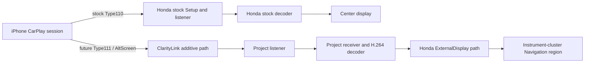

# ClarityLink

ClarityLink’s goal is to keep factory Honda CarPlay on the center display while adding an independent navigation display in the instrument cluster’s existing Navigation region. Apple Maps is the first target; Waze follows if supported. The project preserves the rest of the factory cluster UI.

## Current status — Step 40 (offline)

The project has moved from broad protocol recovery to validating a safe integration boundary around Honda’s exact jmcs build.

- **CONFIRMED / strongly modeled:** stock Type110 Setup and media path; 128-byte screen framing; Type110 AES-CTR/KDF model; VideoConfig and H.264 conversion model.
- **HOST IMPLEMENTED:** copy-on-write Display-B capability model; stock-first Setup response interposer; transactional rollback; fake listener; synthetic receiver path; redacted diagnostics; OFF/NOOP/OBSERVE semantics; ELF identity and mock hook transaction models.
- **CURRENT:** exact-build and call-site fingerprints are verified offline; load-bias resolution is synthetic-testable. The ARM/Thumb call shim, original-call veneer, and executable rollback path are not implemented or validated, so the Honda hook harness is **NOT READY**.
- **NOT PROVEN:** the iPhone requests Type111, accepts a project response, or uses the recovered Type110 KDF for Type111. No real secondary TCP stream, secondary H.264, or cluster rendering from CarPlay has been demonstrated.

No vehicle, ADB, ptrace, live process memory, real listener, CAN, block device, or firmware write is part of Step 40.

## Intended architecture

The target is two independent media paths in one authenticated CarPlay session. This is a design target; Type111 interoperability remains unproven.

**Design invariant:** Honda Type110 remains stock. ClarityLink delegates to Honda first and adds project-owned behavior only after a valid stock result. Project failure returns the original stock result and releases only project resources. The generic mc_dev_attach("CarPlay Screen") registry investigation is fallback-only, not the primary Display-B architecture.

## Project plan

See [ROADMAP.md](ROADMAP.md) for phases, evidence labels, and current gates.

## Start here

| Purpose | File |
|---|---|
| Current state | [PROJECT_STATE.md](PROJECT_STATE.md) |
| Next concrete task | [NEXT_ACTION.md](NEXT_ACTION.md) |
| Evidence index | [EVIDENCE_INDEX.md](EVIDENCE_INDEX.md) |
| Step 40 report | [step-reports/40-honda-hook-harness.md](step-reports/40-honda-hook-harness.md) |
| Honda hook points | [research/carplay/honda-hook-points.md](research/carplay/honda-hook-points.md) |
| Hook fingerprints | [research/carplay/honda-hook-fingerprints.md](research/carplay/honda-hook-fingerprints.md) |
| Runtime address model | [research/carplay/honda-runtime-addressing.md](research/carplay/honda-runtime-addressing.md) |
| Host interposer | [research/carplay/display-b-interposer.md](research/carplay/display-b-interposer.md) |
| Screen transport | [research/carplay/honda-screen-framing.md](research/carplay/honda-screen-framing.md) |

Historical firmware, renderer, and protocol research remains under research/. Raw captures, APKs, firmware, forensic images, and sensitive data stay local and ignored.
