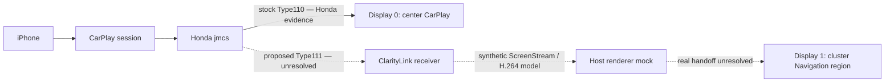

# ClarityLink

[](https://github.com/bmreyes25/ClarityLink/actions/workflows/ci.yml)

ClarityLink is a research and engineering project exploring whether a 2018 Honda Clarity can keep normal CarPlay on its factory center display while using CarPlay's secondary-display architecture to provide independent navigation content in the instrument cluster. The feature is **experimental and not implemented or validated on the vehicle**.

## Goal

| Display | Intended behavior |
|---|---|
| Display 0 — center | Preserve the factory stock CarPlay experience. |
| Display 1 — cluster | Explore an independent navigation stream in the existing Navigation region, starting with Apple Maps; Waze is a later possibility only if supported. |

The design preserves the stock Type110 path and unrelated safety UI. Type111 is an unproven project path; it is not enabled on the Honda.

## Current status

| Area | Status |
|---|---|
| Honda firmware and Type110 | Static Honda evidence exists for examined artifacts and paths; the evidence index states each claim's scope. |
| Type111 on current iOS | A separate Mac/iPhone lab observed two stream topology; it does not establish Honda Type111 behavior or security. |
| Offline dual-display model | Synthetic model and visual demo are available; they prove only the modeled host behavior. |
| Honda network preflight | D4 completed a valid three-phase read-only capture; G11-A-D and the specific-address IPv6 binding policy are resolved. Listener reachability and process ownership remain unknown. |
| Honda Type111 negotiation | Not ready or authorized. Honda acceptance, framing, reachability, and security remain unknown. |
| Cluster rendering | A host-side renderer mock exists; handoff to the real Honda cluster remains unproven. |
| Vehicle deployment | Not implemented or authorized. |

See [current project state](PROJECT_STATE.md), [next action](NEXT_ACTION.md), and the [claim-level evidence index](EVIDENCE_INDEX.md). The current next step is offline 43T1-R0 follow-up; no modifying Honda experiment is authorized.

## Architecture



Solid Type110 is the examined stock Honda path. Dashed links are proposed or modeled boundaries, not proof of a working vehicle feature.

## Evidence discipline

| Label | Meaning |
|---|---|
| `HONDA_CONFIRMED` / `OBSERVED_ON_HONDA_READ_ONLY` | Artifact-backed static evidence or bounded read-only observation, scoped in the cited record. |
| `CURRENT_IOS_LAB_CONFIRMED` | Observed in a separate iPhone lab; not Honda evidence. |
| `LAB_EXECUTABLE_CONFIRMED` / `LAB_HOST_RUNTIME_CONFIRMED` | Executed in a controlled lab or host model; not vehicle proof. |
| `EXTERNAL_PRIOR_ART` | Another project's implementation or documentation; not a Honda requirement. |
| `SYNTHETIC_TEST_VALUE`, `HYPOTHESIS`, `UNKNOWN` | Generated input, proposed interpretation, or unresolved fact. |

Use the [evidence classification guide](docs/development/evidence-classification.md) and [full evidence index](EVIDENCE_INDEX.md) before relying on any claim.

## Safety boundary

Work is offline-first. Any vehicle observation requires a separately reviewed and authorized milestone and a parked vehicle. This project does not perform CAN writes or vehicle-control work. Preserve Type110 and existing safety UI; do not write block devices or add startup persistence. Keep private captures, firmware, credentials, and personal data out of Git. Read the [vehicle testing guide](docs/safety/vehicle-testing.md) before proposing vehicle work.

## See it and try it

The [offline visual twin](demo/type111/README.md) uses synthetic data. From the repository root:

```sh
python3 src/claritylink-sim/export_visual_demo.py --screenstream-h264
python3 -m http.server 8000 --bind 127.0.0.1 --directory demo/type111
```

Open `http://localhost:8000` and select Hypothetical Type111. To run the configured offline checks, install [test requirements](requirements-test.txt) and run:

```sh
python -m pip install -r requirements-test.txt
./tools/run_tests.sh
```

See [development and test instructions](docs/development/testing.md) for details and limits.

## Choose a path

- Curious reader: [architecture](docs/architecture/overview.md) and [roadmap](ROADMAP.md).
- Developer: [contributing](CONTRIBUTING.md), [source guide](src/README.md), [test guide](tests/README.md), and [tool guide](tools/README.md).
- Reverse-engineering researcher: [research guide](research/README.md), [evidence index](EVIDENCE_INDEX.md), and [milestone archive](step-reports/README.md).
- Vehicle-test contributor: [safety guide](docs/safety/vehicle-testing.md) and the [vehicle test proposal form](.github/ISSUE_TEMPLATE/vehicle-test-proposal.yml).

## Repository map

| Path | Role |
|---|---|
| `docs/` | Curated, current reader and contributor guides. |
| `src/`, `tests/`, `tools/` | Models and implementation, verification, and analysis utilities. |
| `research/` | Deep technical investigations and evidence. |
| `step-reports/` | Chronological milestone history, including negative results. |
| `demo/`, `simulator/` | Offline presentation and digital-twin material. |
| Root status files | Detailed records at their established paths: roadmap, project state, next action, and evidence ledger. |

Historical reports and research files are intentionally preserved in place. Start with the [documentation hub](docs/README.md) rather than reading the archive chronologically.

## Project records and community

The detailed engineering records remain at their established paths: [roadmap](ROADMAP.md), [current state](PROJECT_STATE.md), [one next action](NEXT_ACTION.md), and [evidence ledger](EVIDENCE_INDEX.md). See [contribution guidance](CONTRIBUTING.md) and [security reporting](SECURITY.md).

**License: not selected.** No license is granted by this repository at present. See the [owner license decision note](docs/project/license-decision.md).
