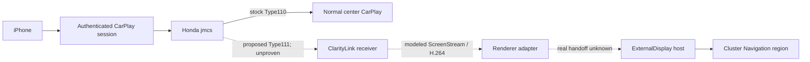

# ClarityLink

ClarityLink researches and models an independent CarPlay navigation stream for the factory instrument-cluster Navigation region of a Honda Clarity, while preserving normal stock CarPlay on the center display and the rest of the cluster's safety UI.

## Goal

Keep the Honda center display's stock CarPlay path working and add a genuine, independent secondary navigation stream to the cluster's existing navigation area. Apple Maps is the first target; Waze is a later target only if the negotiated secondary-screen implementation supports it. The secondary stream must not replace or disturb unrelated stock cluster content.

## Current status

| Capability | Status |
|---|---|
| Offline digital twin | **READY** for the behaviors it models |
| Synthetic Type111 replay | **READY** in explicitly hypothetical mode; strict Honda mode skips unsupported Type111 |
| Synthetic ScreenStream + H.264 | **PASS**: generated H.264 traverses a modeled ScreenStream parser, decodes to RGBA, and reaches a Display 1 mock |
| Honda Type111 negotiation | **NOT READY**; Honda stock path skips unsupported Type111 and the added response is unproven |
| Real ExternalDisplay frame handoff | **NOT READY**; no supported companion frame/Surface interface found |
| Live vehicle testing | **NOT READY**; jmcs integration seam and Type111 wire/security behavior remain unresolved |

## Architecture

The proposed additive path below is not a demonstrated Honda implementation. The dotted links are unresolved integration boundaries.



The design invariant is stock-first: Honda Type110 remains unchanged; ClarityLink would own only separate Type111 state, and a Type111 failure must not disturb Type110.

## Evidence model

- `HONDA_CONFIRMED`: directly supported by a Honda artifact or observation, with scope documented.
- `EXTERNAL_PRIOR_ART`: Apple material or another implementation; useful context, not Honda proof.
- `SYNTHETIC_TEST_VALUE`: generated model/test input, never captured Honda or iPhone output.
- `HYPOTHESIS`: a proposed interpretation awaiting Honda evidence.
- `UNKNOWN`: not established and not silently filled in.

## Offline demo

The static two-display digital twin is in [`demo/type111/`](demo/type111/). From the repository root:

```sh
python3 src/claritylink-sim/export_visual_demo.py --screenstream-h264
python3 -m http.server 8000 --bind 127.0.0.1 --directory demo/type111
```

Open `http://localhost:8000` and select Hypothetical Type111. The exporter decodes the synthetic ScreenStream fixture, submits the RGBA frame to the renderer mock, and writes an ignored PNG for the browser; source-pixel SHA-256 and dimensions are recorded in metadata. If decode or artifact loading fails, the page identifies its schematic fallback. No generated media is committed. Details and limitations are in [the demo guide](demo/type111/README.md).

## Testing

Install the test dependency with `python -m pip install -r requirements-test.txt`, then run [`./tools/run_tests.sh`](tools/run_tests.sh). The H.264 integration test uses synthetic media and checks host capabilities; CI installs FFmpeg. See [testing instructions](docs/development/testing.md).

## Repository layout

| Path | Contents |
|---|---|
| `docs/` | Concise architecture, evidence, research, and development navigation |
| `research/` | Detailed Honda analysis, source evidence, simulator notes, and preserved investigations |
| `step-reports/` | Chronological milestone reports |
| `src/` | Offline models, parsers, receiver, renderer, and tools |
| `tests/` | Synthetic unit/integration suites and isolated smoke tests |
| `simulator/`, `demo/` | Digital twin and local presentation artifacts |
| `tools/` | Read-only helpers and the canonical test runner |
| Root status files | `PROJECT_STATE.md`, `EVIDENCE_INDEX.md`, `NEXT_ACTION.md`, and `ROADMAP.md` remain authoritative |

## Roadmap and research

Start at [ROADMAP.md](ROADMAP.md), [current state](PROJECT_STATE.md), [the next action](NEXT_ACTION.md), and [EVIDENCE_INDEX.md](EVIDENCE_INDEX.md). The [docs index](docs/README.md), [research index](research/README.md), and [step-report index](step-reports/README.md) link into the existing history without moving it.

The latest external-source review is [CarPlay AltScreen prior art](docs/research/carplay-altscreen-prior-art.md), followed by the [Honda-specific research plan](docs/research/honda-type111-research-plan.md).

## Engineering boundaries

Work offline first. Live vehicle work requires its own explicit, reviewed milestone. Do not write block devices or CAN; keep pristine forensic originals unchanged; keep private firmware, captures, credentials, and personal data out of Git. Preserve stock Type110 behavior and make uncertainty visible.

## License

Not yet selected.
