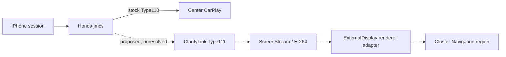

# ClarityLink roadmap

## R6D factory handoff decision

R6D closes the reviewed factory external-handoff path: iAP2 auth and AirPlay receiver are process-local within `jmcs`, with no supported transfer API found. [Decision matrix](research/runtime/r6d-factory-auth-handoff-decision-matrix.md). **R6E:** integrate an authorized host MFi hardware/service and authenticated CarPlay control transport into the custom receiver, then attempt real iPhone `/info` and Setup on Mac. Honda deployment remains a later, separately reviewed milestone. The R6C `ARCH_UNKNOWN` label is historical; R6D makes a bounded interface decision without assigning a new meaning to informal ARCH labels.

## R6C substrate result

R6C traced factory USB/iAP2/MFi and AirPlay ownership inside preserved `jmcs`, including a configured I²C authentication channel. The desired factory authenticated-session handoff remains unresolved. R6D should close the internal auth/iAP2→AirPlay edge and search for a supported boundary before any live observation or target adapter binding. [R6C report](step-reports/43t1-r6c-honda-auth-substrate-reuse.md). The custom receiver remains primary; stock `jmcs` interposition remains parked under R3C.

## R6B authentication boundary — 2026-10-04

**PRIMARY ARCHITECTURE:** custom Honda-compatible receiver. PR #4 merged at `07f7316`; R6B starts from that main commit. **AUTH RESULT:** adapter/replay interfaces complete, no authorized hardware/service or authenticated control handoff connected. **REAL IPHONE:** not reached by ClarityLink. **HIGHEST LEVEL:** R6-L1; R6B below T0. **NEXT:** integrate a user-owned genuine MFi coprocessor or licensed service and its control-session handoff, then attempt real `/info` and SETUP on Mac. **HONDA DEPLOYMENT:** not authorized. See the [R6B report](step-reports/43t1-r6b-authentication-and-real-ios-negotiation.md), [readiness](research/runtime/r6b-custom-receiver-readiness.md), and [auth inventory](research/runtime/r6b-authentication-session-inventory.md).

## Historical R6A architecture pivot — 2026-10-04

**PRIMARY ARCHITECTURE:** clean-room Honda-compatible custom CarPlay receiver owning Type110 and Type111 in one session. **STOCK jmcs INTERPOSITION:** parked under R3C. **DESCENDANT FIRMWARE RESEARCH:** opportunistic supporting research. **IMMEDIATE TARGET:** real iPhone Type111 negotiation, security, media, decode and host display (R6-L7). **HONDA DEPLOYMENT:** not authorized. The [R6A ADR](research/adr/r6-custom-receiver-primary-architecture.md), [readiness matrix](research/runtime/r6a-custom-receiver-readiness.md), and [milestone report](step-reports/43t1-r6a-custom-receiver-canonical-pivot.md) supersede the R5D next-action recommendation. Current Python receiver reaches host synthetic T1 only; MFi/auth, full /info, real Type111 framing/security and Honda adapters remain open.

**Goal:** one simultaneous iPhone CarPlay session, normal Type110 center display, and independent Type111 navigation video on the cluster, with stock-quality audio, controls, warning coexistence and teardown.

## R6A engineering stage (historical)

R6A merged R5Z onto R5D main and selected the custom receiver as primary. The Python host reference passes synthetic T1; no real iPhone Setup/media has reached it. R6B starts with legitimate host authentication/session ownership and full `/info`. Honda USB/iAP2/MFi/audio/control/display/lifecycle adapters remain evidence gated. Descendant firmware is opportunistic.

| Level | Gate | Status |
|---|---|---|
| R6-L0 | architecture pivot | complete |
| R6-L1 | integrated receiver core | complete on host |
| R6-L2 | full host /info + authenticated Setup | open |
| R6-L3 | real Type111 listener connection | open |
| R6-L4 | real Type111 framing | open |
| R6-L5 | real Type111 security | open |
| R6-L6 | decoded real Type111 frame | open |
| R6-L7 | displayed real Type111 host window | immediate target |
| R6-L8 | complete host Type110+Type111 receiver | future |
| R6-L9 | API17/ARMv7 build | future |
| R6-L10 | Honda substrate adapters | future |
| R6-L11 | separately authorized parked-car execution | not authorized |
| R6-L12 | simultaneous in-car displays | final target |

## Historical roadmap and stock receiver research

## Historical receiver target (superseded by R3C/R4A)

The target architecture keeps Honda Type110 stock and adds a separate Type111 path inside/alongside the CarPlay session owner, with a renderer adapter in the ExternalDisplay host. Those integration seams remain unproven for Honda.

## Historical workstream and gates

| Workstream | Current state | Next gate |
|---|---|---|
| Offline digital twin | Synthetic visual and transaction models are available | Models remain distinct from Honda proof |
| Honda `/info` / Type111 | Stock Type110 path has static evidence; Honda Type111 acceptance/schema unknown | Preserve as unknown until specifically evidenced |
| Type111 security/session | Type110 evidence does not prove Type111 crypto or lifecycle | No crypto selection or negotiation authorization |
| Honda network preflight | D0-3 read-only procedure reviewed; earlier attempt stopped before target reads | Separately initiated D4 observation under current gates |
| `jmcs` integration | Expanded R3C found no safe additive runtime extension path in preserved evidence | Pivot offline; reopen only on new static evidence |
| Cluster rendering | Host-side mock exists; real Display Audio frame handoff unresolved | Requires independent evidence and review |
| Vehicle deployment | Not implemented or authorized | Requires separately scoped, reviewed milestones |

## Important distinction

Apple, xcertplay, MHI2, and CPC200 establish external architecture or receiver-specific prior art. They do not prove Honda behavior. See the [source-pinned research](docs/research/carplay-altscreen-prior-art.md), [Honda research plan](docs/research/honda-type111-research-plan.md), [project state](PROJECT_STATE.md), and [next action](NEXT_ACTION.md).

## Historical stock-interposition invariants

- Stock Type110 response, data path, crypto state, center display, and audio remain unchanged.
- Type111-only failure must clean up Type111-owned resources only.
- Synthetic and external-prior-art fields retain their evidence labels.
- Live Type111 and jmcs no-op loading remain NOT READY until their explicit gates pass.

## R5B — Honda descendant artifact search (2026-10-04)

R5B found versioned public research metadata for a close 2016–2021 Civic Andromeda/vcm30t30 family, including a 2021 Civic EX `1.F1A5.15` lead. No lawful, versioned descendant receiver payload was available for review, so Type111 remains `TYPE111_INSUFFICIENT_ARTIFACT`; this does not establish absence. The next milestone is continued public artifact/provenance research. R3C runtime NO-GO remains, R5X remains MODEL_ONLY, R4D Display 1 remains possible but unproven, and no vehicle action is authorized. See [R5B report](step-reports/43t1-r5b-honda-descendant-artifact-and-type111-static-triage.md).
