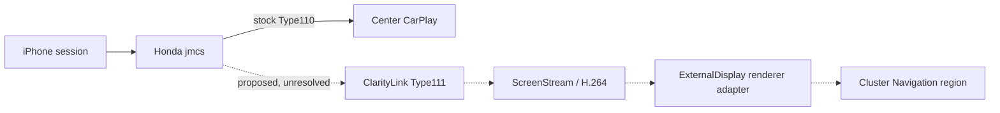

# ClarityLink roadmap

**Goal:** preserve stock Honda CarPlay on the center display while adding an independent navigation stream in the instrument cluster's existing Navigation region. Apple Maps is the first target; Waze is conditional on negotiated secondary-screen support. Preserve all other stock safety and cluster UI.

## Current engineering stage

The latest completed milestone is **43T1-R3C expanded offline static entry/ownership closure**. The preserved dynamic, proxy, service, factory, dispatch, and loader evidence supplies no safe additive session-addressable runtime extension path. The architecture recommendation is to stop `jmcs` runtime interposition until new static evidence appears. Type111 acceptance/security, runtime attachment, and deployment remain unproven and unauthorized. See [NEXT_ACTION.md](NEXT_ACTION.md), the [R3C report](step-reports/43t1-r3c-static-entry-ownership-closure.md), and the [ADR](research/adr/43t1-r3c-entry-and-ownership-architecture.md).

## Evidence-backed target

The target architecture keeps Honda Type110 stock and adds a separate Type111 path inside/alongside the CarPlay session owner, with a renderer adapter in the ExternalDisplay host. Those integration seams remain unproven for Honda.

## Workstream and gates

| Workstream | Current state | Next gate |
|---|---|---|
| Offline digital twin | Synthetic visual and transaction models are available | Models remain distinct from Honda proof |
| Honda `/info` / Type111 | Stock Type110 path has static evidence; Honda Type111 acceptance/schema unknown | Preserve as unknown until specifically evidenced |
| Type111 security/session | Type110 evidence does not prove Type111 crypto or lifecycle | No crypto selection or negotiation authorization |
| Honda network preflight | D0-3 read-only procedure reviewed; earlier attempt stopped before target reads | Separately initiated D4 observation under current gates |
| `jmcs` integration | Expanded R3C found no safe additive runtime extension path in preserved evidence | Pivot offline; reopen only on new static evidence |
| Cluster rendering | Host-side mock exists; real Display Audio frame handoff unresolved | Requires independent evidence and review |
| Vehicle deployment | Not implemented or authorized | Requires separately scoped, reviewed milestones |

## Important distinction

Apple, xcertplay, MHI2, and CPC200 establish external architecture or receiver-specific prior art. They do not prove Honda behavior. See the [source-pinned research](docs/research/carplay-altscreen-prior-art.md), [Honda research plan](docs/research/honda-type111-research-plan.md), [project state](PROJECT_STATE.md), and [next action](NEXT_ACTION.md).

## Invariants

- Stock Type110 response, data path, crypto state, center display, and audio remain unchanged.
- Type111-only failure must clean up Type111-owned resources only.
- Synthetic and external-prior-art fields retain their evidence labels.
- Live Type111 and jmcs no-op loading remain NOT READY until their explicit gates pass.
