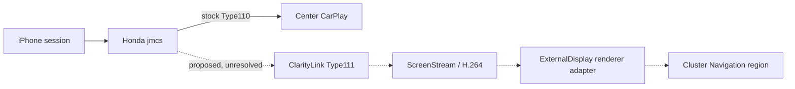

# ClarityLink roadmap

**Goal:** preserve stock Honda CarPlay on the center display while providing useful, independently sourced navigation content in the instrument cluster's Navigation region. The source must be user controlled and legally available; the current host model uses synthetic steps. Preserve all other stock safety and cluster UI.

## Current engineering stage

[R5C public artifact provenance expansion](step-reports/43t1-r5c-public-artifact-provenance-expansion.md) is the latest research milestone: `R5C_NEW_HIGH_CONFIDENCE_ARTIFACT_LEAD_FOUND` / `GO_FOR_R5D_ARTIFACT_PROVENANCE_CLOSURE`. Honda bulletin 19-101 identifies `1.F197.60` (2016 Civic) and `1.F196.39` (2017 Civic) for specific EX/EX-T/Touring 2/4-door units, but its dealer workflow does not expose a public receiver payload. The preceding R5B result was no lawful analyzable artifact; its 2021 Civic EX `1.F1A5.15` Andromeda/vcm30t30 family remains a related lead. R3C runtime `jmcs`/Type111 NO-GO remains controlling; R4D ordinary-app Display 1 remains possible but unproven; R5X and R5Y remain host-only models. Rules v2 governs and only offline/public provenance research is authorized.

## Historical receiver target (superseded by R3C/R4A)

The target architecture keeps Honda Type110 stock and adds a separate Type111 path inside/alongside the CarPlay session owner, with a renderer adapter in the ExternalDisplay host. Those integration seams remain unproven for Honda.

## Workstream and gates

| Workstream | Current state | Next gate |
|---|---|---|
| Offline digital twin | Synthetic visual and transaction models are available | Models remain distinct from Honda proof |
| Honda `/info` / Type111 | Stock Type110 path has static evidence; Honda Type111 acceptance/schema unknown | Preserve as unknown until specifically evidenced |
| Type111 security/session | Type110 evidence does not prove Type111 crypto or lifecycle | No crypto selection or negotiation authorization |
| Honda network preflight | D0-3 read-only procedure reviewed; earlier attempt stopped before target reads | Separately initiated D4 observation under current gates |
| `jmcs` integration | Expanded R3C found no safe additive runtime extension path in preserved evidence | Pivot offline; reopen only on new static evidence |
| Cluster rendering | Host-side mock exists; real Display Audio frame handoff unresolved | Requires independent evidence and review |
| Vehicle deployment | Not implemented or authorized | Requires separately scoped, reviewed milestones |

## Important distinction

Apple, xcertplay, MHI2, and CPC200 establish external architecture or receiver-specific prior art. They do not prove Honda behavior. See the [source-pinned research](docs/research/carplay-altscreen-prior-art.md), [Honda research plan](docs/research/honda-type111-research-plan.md), [project state](PROJECT_STATE.md), and [next action](NEXT_ACTION.md).

## Invariants

- Stock Type110 response, data path, crypto state, center display, and audio remain unchanged.
- Type111-only failure must clean up Type111-owned resources only.
- Synthetic and external-prior-art fields retain their evidence labels.
- Live Type111 and jmcs no-op loading remain NOT READY until their explicit gates pass.

## R5B — Honda descendant artifact search (2026-10-04)

R5B found versioned public research metadata for a close 2016–2021 Civic Andromeda/vcm30t30 family, including a 2021 Civic EX `1.F1A5.15` lead. No lawful, versioned descendant receiver payload was available for review, so Type111 remains `TYPE111_INSUFFICIENT_ARTIFACT`; this does not establish absence. The next milestone is continued public artifact/provenance research. R3C runtime NO-GO remains, R5X remains MODEL_ONLY, R4D Display 1 remains possible but unproven, and no vehicle action is authorized. See [R5B report](step-reports/43t1-r5b-honda-descendant-artifact-and-type111-static-triage.md).
