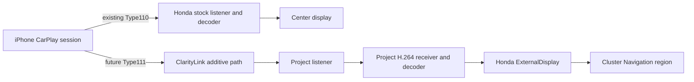

# ClarityLink roadmap

**Project goal:** Keep factory Honda CarPlay independently usable on the center display while adding an independent navigation display in the instrument cluster’s existing Navigation region. Preserve all other stock cluster UI. Apple Maps first, Waze if supported.

## Architecture

The design target is an additive second stream on the same authenticated CarPlay session. Honda’s stock Type110 path remains untouched; ClarityLink would add a project-owned Type111/AltScreen path, receiver, decoder, and ExternalDisplay output. This is an architecture hypothesis until iPhone Type111 negotiation and crypto are proven.

## Phases

| Phase | Scope | Status |
|---|---|---|
| A | Firmware acquisition and display reverse engineering | **COMPLETE** offline |
| B | Honda CarPlay control/media protocol recovery | **SUBSTANTIALLY COMPLETE**; some runtime semantics remain unknown |
| C | Host Display-B architecture, stock delegation, synthetic receive path | **COMPLETE** as a host model |
| D | Exact Honda build identity, hook points, reversible hook harness | **CURRENT**; ABI and static fingerprints recovered, ARM/Thumb call shim and live-safe rollback remain unimplemented |
| E | Parked no-op stock-delegation validation | **NOT READY**; only after Step 40’s real hook harness passes review |
| F | Observe-only secondary negotiation | Future; no live collection |
| G | Controlled Display-B / Type111 advertisement | Future; response acceptance unknown |
| H | Type111 listener, security, secondary TCP | Future; Type111 KDF and phone acceptance unknown |
| I | Real secondary H.264 receive/decode | Future; no real Type111 stream |
| J | ExternalDisplay / instrument-cluster rendering | Future; no real CarPlay output |
| K | Apple Maps/Waze validation and production hardening | Future |

## Current offline findings

- **CONFIRMED:** exact local Honda binary identity is ELF32 little-endian ARM, ET_DYN, file SHA-256 cbc7ba881648fb8ffdfcc4c1100a028345c37134a2ae3b9dff7d76572851c232, .text SHA-256 ca4abfd2f2c1f5f7fe88b4b0bde9e920d22b454f2a699b7de1f4984c901278eb, file size 13,406,720 bytes. It has Android identification notes and no GNU build-id.
- **CONFIRMED:** a /info server-info return and a stock Setup callsite provide narrow candidate control-plane interception points.
- **HIGH CONFIDENCE:** two semantic control-plane points are needed for capability advertisement and Setup response augmentation. Persistent project state also needs session-start/teardown lifecycle coordination.
- **UNKNOWN:** runtime callback threading/reentrancy and native CF replacement ownership at every candidate point.
- **NOT READY:** no ARM/Thumb shim, branch veneer, original-call trampoline, or executable-memory rollback has been implemented. Mock memory success is not live-hook safety.
- **NOT PROVEN:** iPhone Type111 trigger/acceptance, Type111 KDF compatibility, real second TCP stream/H.264, cluster rendering.

## Safety rules

- Preserve factory center CarPlay and leave Type110 unchanged.
- Keep Type111 capability and response behavior off by default.
- Require exact ELF and instruction fingerprints; reject partial/mismatched hook groups.
- Never infer Honda behavior from MHI2 or host fixtures.
- No secrets in logs or commits.
- No CAN writes, block-device writes, or firmware flashing.
- Treat generic mc_dev_attach("CarPlay Screen") registry work as fallback-only.
- Do not run Step 41 until the no-op hook harness is actually implemented and reviewed.

## Next

Complete the missing offline Step 40 item: implement and validate an ARMv7 Thumb-2 callsite shim/original-call veneer and a platform-specific reversible patch/restore path in a controlled host/emulator harness. Until then the no-op live test remains **NO**.
