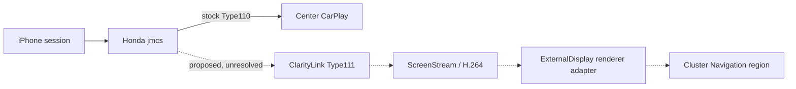

## Current roadmap — R7E4 exact-head validation

1. R7E4 implementation head `47605adad4e83faa8e05e028cd46282848546139` and final PR verification head `3133e36f82b86ed2fa1a0963115f6745ae752b6c` passed Offline CI and CodeQL; PR #19 is OPEN and MERGEABLE.
2. Decision: `R7E_A0R_RESEARCH_HARDENED_READY`; next action `READY_FOR_EXPLICIT_USER_A0R_AUTHORIZATION`, A0-R only.
3. Review actual A0-R evidence before considering A0-W; Test A remains separately authorized and blocked.

R7E4 performs no Honda command, ADB target enumeration, target write, transfer, USB role change, display activity, iAP2/MFi, iPhone, or CarPlay action. See [R7E4 report](step-reports/43t1-r7e4-a0r-research-hardening.md).

## R7E1 — offline target diagnostic artifact closure

R7E1 closes the offline target-artifact gap using split Test A native CLI and B–D API17 APK artifacts. Decision `R7E_ARTIFACT_COMPLETE_TEST_A_EVIDENCE_BLOCKED`; Test A remains unauthorized pending Honda-only destination, privilege, power-state, command, and rollback evidence. Next: push PR #19 and verify exact-head Offline CI/CodeQL; leave PR open. See [R7E1 report](step-reports/43t1-r7e1-target-diagnostic-artifact-closure.md) and [readiness decision](research/runtime/r7e1-test-a-readiness-decision.md).

- [43T1-R7C3 — final Android integration closure attempt](step-reports/43t1-r7c3-final-android-integration-closure.md) — test-only JNI socket/exception seams and native builds added, but APK/Dalvik and complete race/fault closure remain blocked; R7C stays partial and R7D closed.

## R7C2 Android runtime integration closure — partial — 2026-10-07

R7C2 continued PR #17 and closed the actual API17 Dalvik/JNI/Surface runtime gap using an isolated x86 AVD. Production Java display adapters, Presentation/Surface callbacks, ANativeWindow RGBA post, actual Type110/Type111 H.264 outputs, selected Java adapters, and 100 resource-checked lifecycle cycles passed. Classification: `ANDROID_API17_DALVIK_RUNTIME_CONFIRMED_X86`; ARMv7 remains build-only. R7C decision: `R7C_INTEGRATION_PARTIAL` because native Android POSIX socket runtime integration, exhaustive JNI VM exception/reference tests, and deterministic framework stop/callback fault coverage are not closed. The R7D entry gate remains closed.

Next: `GO_FOR_R7C_INTEGRATION_CLOSURE`. Do not advance to R7D or infer Honda behavior until software closure is complete. Honda display admission, warning safety, safe area, real authentication/protocol security, USB ownership, audio/control equivalence and restoration remain evidence gated. No Honda or vehicle execution occurred. See [R7C2 report](step-reports/43t1-r7c2-android-runtime-integration-closure.md).

## R7C1 JNI/Surface integration closure — 2026-10-07

R7C1 continues PR #17 from starting HEAD `25bf1436f71587e9984940b88d7766a9fa2f44fb`. JNI opaque handle and Surface lifecycle cores now have host tests; real R7B decoder output runs through separate Type110/Type111 host surface cores. A 100-cycle host-simulated receiver/surface integration and ASan/UBSan/TSan passed. API17/ARMv7 rebuild/import audit passed. This does not exercise ART JNI entrypoints, actual ANativeWindow/Presentation, or Java all-adapter behavior; the full fault matrix remains incomplete. Decision `R7C_INTEGRATION_PARTIAL`.

Next: `GO_FOR_R7C_INTEGRATION_CLOSURE`. The [R7D entry gate](research/runtime/r7c-r7d-entry-gate.md) is closed until JNI/Android/Java integration and full fault coverage are complete. No Honda execution or evidence escalation.

## R7C Android/Honda-facing adapter implementation — 2026-10-07

R7B PR #16 merged at `087f17fb9268f623eabd520c3542b00db0d512b9`. R7C implements API17 Java adapters and an API17 ARMv7 JNI/ANativeWindow/socket library with a fail-closed Display1 Presentation candidate. API17 Java/ARM compilation, API17 symbol audit, socket sanitizer test, Java evidence-policy test, and R7A/R7B regressions passed. Full Android/JNI/display/receiver integration and all lifecycle/fault tests did not run; decision is `R7C_INTEGRATION_PARTIAL`.

Next: `GO_FOR_R7C_INTEGRATION_CLOSURE`. Complete Android/JNI runtime coverage, integrated failure matrix and 100 receiver+adapter lifecycle cycles before R7D. Honda target execution remains outside R7C and every Honda-only unknown stays evidence-gated. See [R7C report](step-reports/43t1-r7c-honda-target-adapter-implementation.md).

# ClarityLink roadmap

## R7C4 closure status — blocked — 2026-10-07

R7C4 restored the local JDK/pytest environment and ran the updated APK on the isolated API17 Dalvik emulator. One fragmented Type110 native socket route, JNI exception probes, and a 100-cycle synthetic-ingest lifecycle run passed. Deterministic framework races and full socket/fault/resource coverage remain incomplete; the final ARMv7 audit and exact-head hosted checks are also outstanding. R7C remains blocked as `R7C_FRAMEWORK_RACE_BLOCKED`; R7D is CLOSED. Next action: complete those gates on one final revision. See [R7C4 report](step-reports/43t1-r7c4-final-android-integration-closure.md).

## R7 offline implementation first — 2026-10-06

**`R7_OFFLINE_IMPLEMENTATION_FIRST`** supersedes the R6 CPC200 prerequisite for offline receiver development. R7A starts from verified main `c254d7f6172dbd45bb1cd6a87b10bcb4cd96d811` and builds on existing R6 receiver/session/security components. R7A outcome: `R7A_INTEGRATED_SYNTHETIC_DUAL_STREAM_PASS`, host/model-only. The 901-pass repository suite and local repository health passed. Offline CI and CodeQL passed on implementation head `bb80c159421d92452ecc6405ac264cb8fc615734`; the newest PR head is checked separately. See [R7A report](step-reports/43t1-r7a-integrated-offline-dual-carplay.md) and [adapter boundary inventory](research/runtime/r7a-host-honda-boundary-inventory.md).

Next: **`GO_FOR_R7B_ANDROID_API17_ARMV7_NATIVE_BUILD`**. CPC200 remains optional for R7B. Genuine MFi, real iPhone negotiation, real Type111 security/media, Honda auth/USB ownership, target executable compatibility, Display1 admission, safety coexistence and stock restoration remain unresolved. No R7A result promotes R6 evidence or authorizes Honda/vehicle action.

The R6 chronology below remains historical evidence, not deleted or retrospectively rewritten. Its CPC200-gated real-session path remains relevant to later real-iPhone validation.

## R7B native target build — 2026-10-06

R7A merged at `f0d800678684979277f9ad0b8f43c30153960eda`. The R7 implementation-first sequence supersedes R6's CPC200-first ordering for offline receiver work while preserving all R6 evidence and decisions unchanged. R7A established `R7A_INTEGRATED_SYNTHETIC_DUAL_STREAM_PASS` using host/model evidence. R7B adds a native host implementation and reproducible Android 4.2.2/API17/ARMv7 build; that build does not establish Honda execution or real CarPlay compatibility. R7C is the later Honda adapter milestone and requires its own evidence and authorization.

**R7B result:** `R7B_ANDROID_API17_ARMV7_NATIVE_PASS`. Native dual-stream slice, software decode, host/native fixture conformance, 100-cycle lifecycle, API17 symbol audit and ARMv7 artifact inspection are implemented and locally verified. Offline CI and all CodeQL jobs passed on the final exact PR head. The current branch is `architecture/r7b-api17-armv7-native-build`, based on R7A merge `f0d800678684979277f9ad0b8f43c30153960eda`.

**Next:** `GO_FOR_R7C_HONDA_ADAPTER_IMPLEMENTATION`; do not infer Honda compatibility from cross-compilation. Genuine MFi, real iPhone negotiation, Type111 security/framing, Honda USB/iAP2 ownership, both display admissions, audio/controls and stock restoration remain unresolved.

## Canonical seven-gate program — 2026-10-05

1. **Gate 1 — Mac auth/control authority:** R6H is blocked on completing the LIVI Node IPC/authentication proof and app-root wiring; CPC200 is absent.
2. **Gate 2 — Complete Mac receiver:** not started; real `/info`, SETUP and Type110/111 follow Gate 1.
3. **Gate 3 — API17/ARMv7 build:** not started.
4. **Gate 4 — Honda process/lifecycle:** not started; no Honda work authorized in this milestone.
5. **Gate 5 — Honda Display1:** not started.
6. **Gate 6 — Honda Display0:** not started.
7. **Gate 7 — Honda USB/iAP2/auth architecture:** not started.

R6H result: `GATE1_SOFTWARE_READY_HARDWARE_REQUIRED`; next `GO_FOR_GATE1_HARDWARE_AUTHORITY_BRINGUP`. No Gate 2 work begins until the real Gate 1 criterion is met.

## Canonical Mac receiver trajectory

**R6F authority selection** → **R6G LIVI seam** → **R6H Gate 1 software bridge + genuine Mac authority bring-up** → **Gate 1 real authenticated control session and /info+SETUP ownership** → **Gate 2 complete Mac receiver** → **Gate 3 API17/ARMv7 build** → **Gate 4 Honda process/lifecycle** → **Gate 5 Honda Display1** → **Gate 6 Honda Display0** → **Gate 7 Honda USB/iAP2/auth architecture**. Honda stages remain later; no Honda work is authorized by R6H. R6F did not contact Honda, use ADB, or connect to a vehicle. Synthetic/replay evidence cannot satisfy these real-iPhone gates. See [R6F authority acquisition](research/runtime/r6f-authority-acquisition-specification.md) and [complete Mac receiver roadmap](research/runtime/r6f-complete-mac-receiver-roadmap.md).

## R6G authority/control handoff result — 2026-10-05

R6F PR #11 merged at `7fadb23b2fa599a82207ae22a2f1fc2e1a6757ee`. R6G public source review found LIVI's `CpStack.attachSocket` owns parsing, dispatch, and the sole response writer; the narrow seam is before `_handle`, requiring a small upstream delegate patch. The Python ClarityLink provider is implemented to the existing boundary, but the LIVI delegate/bridge is not; adapter result `R6G_LIVI_ADAPTER_PARTIAL`. CPC200 not detected, no provisioning or real iPhone attempt; highest tier `BELOW_R6G_T0`. Next is `GO_FOR_R6H_LIVI_ADAPTER_COMPLETION`, then hardware bring-up and real `/info`. See [R6G report](step-reports/43t1-r6g-livi-authority-bringup.md) and [seam](research/runtime/r6g-livi-control-session-seam.md). No Honda work.

## R6F authority selection and R6G action

R6E merged at `9ab9d77`. R6F selected user-owned Carlinkit CPC200-CCPA + LIVI Link/LIVI macOS receiver as the concrete acquisition path; no unit is present, no ClarityLink control handoff exists, and no real iPhone gate was reached. **R6G:** acquire and verify the exact hardware revision, establish genuine authority, adapt the LIVI authenticated control session, then drive real `/info`, SETUP and Type111. See [R6F acquisition](research/runtime/r6f-authority-acquisition-specification.md) and [R6F report](step-reports/43t1-r6f-authority-integration.md). Honda deployment remains later and separate.

## R6D factory handoff decision

R6D closes the reviewed factory external-handoff path: iAP2 auth and AirPlay receiver are process-local within `jmcs`, with no supported transfer API found. [Decision matrix](research/runtime/r6d-factory-auth-handoff-decision-matrix.md). **R6E:** integrate an authorized host MFi hardware/service and authenticated CarPlay control transport into the custom receiver, then attempt real iPhone `/info` and Setup on Mac. Honda deployment remains a later, separately reviewed milestone. The R6C `ARCH_UNKNOWN` label is historical; R6D makes a bounded interface decision without assigning a new meaning to informal ARCH labels.

## R6C substrate result

R6C traced factory USB/iAP2/MFi and AirPlay ownership inside preserved `jmcs`, including a configured I²C authentication channel. The desired factory authenticated-session handoff remains unresolved. R6D should close the internal auth/iAP2→AirPlay edge and search for a supported boundary before any live observation or target adapter binding. [R6C report](step-reports/43t1-r6c-honda-auth-substrate-reuse.md). The custom receiver remains primary; stock `jmcs` interposition remains parked under R3C.

## R6B authentication boundary — 2026-10-04

**PRIMARY ARCHITECTURE:** custom Honda-compatible receiver. PR #4 merged at `07f7316`; R6B starts from that main commit. **AUTH RESULT:** adapter/replay interfaces complete, no authorized hardware/service or authenticated control handoff connected. **REAL IPHONE:** not reached by ClarityLink. **HIGHEST LEVEL:** R6-L1; R6B below T0. **NEXT:** integrate a user-owned genuine MFi coprocessor or licensed service and its control-session handoff, then attempt real `/info` and SETUP on Mac. **HONDA DEPLOYMENT:** not authorized. See the [R6B report](step-reports/43t1-r6b-authentication-and-real-ios-negotiation.md), [readiness](research/runtime/r6b-custom-receiver-readiness.md), and [auth inventory](research/runtime/r6b-authentication-session-inventory.md).

## Historical R6A architecture pivot — 2026-10-04

**PRIMARY ARCHITECTURE:** clean-room Honda-compatible custom CarPlay receiver owning Type110 and Type111 in one session. **STOCK jmcs INTERPOSITION:** parked under R3C. **DESCENDANT FIRMWARE RESEARCH:** opportunistic supporting research. **IMMEDIATE TARGET:** real iPhone Type111 negotiation, security, media, decode and host display (R6-L7). **HONDA DEPLOYMENT:** not authorized. The [R6A ADR](research/adr/r6-custom-receiver-primary-architecture.md), [readiness matrix](research/runtime/r6a-custom-receiver-readiness.md), and [milestone report](step-reports/43t1-r6a-custom-receiver-canonical-pivot.md) supersede the R5D next-action recommendation. Current Python receiver reaches host synthetic T1 only; MFi/auth, full /info, real Type111 framing/security and Honda adapters remain open.

**Goal:** one simultaneous iPhone CarPlay session, normal Type110 center display, and independent Type111 navigation video on the cluster, with stock-quality audio, controls, warning coexistence and teardown.

## R6A engineering stage (historical)

R6A merged R5Z onto R5D main and selected the custom receiver as primary. The Python host reference passes synthetic T1; no real iPhone Setup/media has reached it. R6B starts with legitimate host authentication/session ownership and full `/info`. Honda USB/iAP2/MFi/audio/control/display/lifecycle adapters remain evidence gated. Descendant firmware is opportunistic.

| Level | Gate | Status |
|---|---|---|
| R6-L0 | architecture pivot | complete |
| R6-L1 | integrated receiver core | complete on host |
| R6-L2 | full host /info + authenticated Setup | open |
| R6-L3 | real Type111 listener connection | open |
| R6-L4 | real Type111 framing | open |
| R6-L5 | real Type111 security | open |
| R6-L6 | decoded real Type111 frame | open |
| R6-L7 | displayed real Type111 host window | immediate target |
| R6-L8 | complete host Type110+Type111 receiver | future |
| R6-L9 | API17/ARMv7 build | future |
| R6-L10 | Honda substrate adapters | future |
| R6-L11 | separately authorized parked-car execution | not authorized |
| R6-L12 | simultaneous in-car displays | final target |

## Historical roadmap and stock receiver research

## Historical receiver target (superseded by R3C/R4A)

The target architecture keeps Honda Type110 stock and adds a separate Type111 path inside/alongside the CarPlay session owner, with a renderer adapter in the ExternalDisplay host. Those integration seams remain unproven for Honda.

## Historical workstream and gates

| Workstream | Current state | Next gate |
|---|---|---|
| Offline digital twin | Synthetic visual and transaction models are available | Models remain distinct from Honda proof |
| Honda `/info` / Type111 | Stock Type110 path has static evidence; Honda Type111 acceptance/schema unknown | Preserve as unknown until specifically evidenced |
| Type111 security/session | Type110 evidence does not prove Type111 crypto or lifecycle | No crypto selection or negotiation authorization |
| Honda network preflight | D0-3 read-only procedure reviewed; earlier attempt stopped before target reads | Separately initiated D4 observation under current gates |
| `jmcs` integration | Expanded R3C found no safe additive runtime extension path in preserved evidence | Pivot offline; reopen only on new static evidence |
| Cluster rendering | Host-side mock exists; real Display Audio frame handoff unresolved | Requires independent evidence and review |
| Vehicle deployment | Not implemented or authorized | Requires separately scoped, reviewed milestones |

## Important distinction

Apple, xcertplay, MHI2, and CPC200 establish external architecture or receiver-specific prior art. They do not prove Honda behavior. See the [source-pinned research](docs/research/carplay-altscreen-prior-art.md), [Honda research plan](docs/research/honda-type111-research-plan.md), [project state](PROJECT_STATE.md), and [next action](NEXT_ACTION.md).

## Historical stock-interposition invariants

- Stock Type110 response, data path, crypto state, center display, and audio remain unchanged.
- Type111-only failure must clean up Type111-owned resources only.
- Synthetic and external-prior-art fields retain their evidence labels.
- Live Type111 and jmcs no-op loading remain NOT READY until their explicit gates pass.

## R5B — Honda descendant artifact search (2026-10-04)

R5B found versioned public research metadata for a close 2016–2021 Civic Andromeda/vcm30t30 family, including a 2021 Civic EX `1.F1A5.15` lead. No lawful, versioned descendant receiver payload was available for review, so Type111 remains `TYPE111_INSUFFICIENT_ARTIFACT`; this does not establish absence. The next milestone is continued public artifact/provenance research. R3C runtime NO-GO remains, R5X remains MODEL_ONLY, R4D Display 1 remains possible but unproven, and no vehicle action is authorized. See [R5B report](step-reports/43t1-r5b-honda-descendant-artifact-and-type111-static-triage.md).

## R6 Gate trajectory (canonical)

R6F authority selection → R6G LIVI seam → R6H software delegate/bridge → **R6H1 CPC200/LIVI Link authority bring-up (Gate 1; blocked waiting for CPC200; Gate 1 remains open)** → real authenticated ClarityLink `/info` → Gate 2 complete real Mac receiver → Gate 3 API17/ARMv7 target build → Gate 4 Honda process/lifecycle adapter → Gate 5 Honda Display1 adapter → Gate 6 Honda Display0 adapter → Gate 7 Honda USB/iAP2/auth target architecture. Gate 2 remains `NOT_STARTED`; no Honda activity is authorized by this sequence. R6H1 reached no real-iPhone tier.
## R7C5 milestone correction (2026-10-08)

R7C5 did not pass its software acceptance gate. Local NDK r23c ARMv7/API17 build/import audit and repository/host checks passed, but deterministic framework races, expanded Android native socket faults, per-cycle native socket integration/resource assertions, and exact-head hosted checks remain open. R7D stays CLOSED; no merge or R7D work is authorized by this evidence. See [R7C5 decision](research/runtime/r7c5-r7d-entry-decision.md).
## R7C6 update (2026-10-08)

R7C closure is still blocked by the remaining framework lifecycle races,
Dalvik socket matrix, exact-current final runtime evidence, and verification
gates. R7D has not started and remains CLOSED. See
`research/runtime/r7c6-r7d-entry-decision.md`.

## R7C7 — final software blocker closure (2026-10-08)

The owned-emulator R7C software evidence is complete: production Dalvik socket faults, cumulative Activity teardown, socket-inclusive 100 cycles, repository suite/sanitizers, and API17 ARMv7 import audit pass. Next: commit/push, exact-head Offline CI and CodeQL, and merge PR #17; then begin R7D from the merge commit. No Honda or vehicle execution is part of R7C7/R7D.

## R7D — integrated target simulation (active, 2026-10-08)

R7C merged at `f9ef5fa3f24ed89b32d0eddf62b1065fbef66562` with exact-head CI and CodeQL green. R7D worktree/branch starts from that commit. Current results and remaining tests are tracked in the [R7D report](step-reports/43t1-r7d-integrated-target-simulation.md) and `research/runtime/r7d-*` evidence. No Honda execution.

## R7D local acceptance update — 2026-10-08

Local R7D acceptance passed. The synthetic API17 run sustained both streams for 30 minutes, with 14.405 FPS measured against the 30-FPS target; the gap is recorded. All fault/stress paths, cleanup, repository checks, ARMv7 import audit, and post-run R7C regression passed. PR #18's exact-head Offline CI and CodeQL passed. R7E entry is open for preparation only; next action is `GO_FOR_R7E_PARKED_CAR_COMPATIBILITY_PREPARATION`. No Honda or vehicle execution occurred.
## R7E current gate — target diagnostic artifact blocked

R7D PR #18 merged at `edea469044c1e259a43e3dd441600e95e148670a`. R7E produced separate preparation plans for Tests A–H; no test is authorized. The first Test A plan remains blocked until a fail-closed API17/ARMv7 diagnostic is built and audited with NDK r23c. **Next:** offline artifact implementation/build/audit; see [R7E readiness](research/runtime/r7e-first-test-readiness.md). The 14.405-FPS R7D result remains emulator-only and does not predict Honda performance.
## R7E2: A0-R read-only preflight plan is ready for separate authorization. Do not execute during preparation. A0-W and Test A remain separately gated. See `research/runtime/r7e2-test-a-readiness-decision.md`.
## Current R7E3 gate — authorization boundary

R7E3 A0-R host collection package is ready for review. No Honda action has been authorized or executed. Next action is to wait for a separate explicit A0-R authorization tied to the exact collector commit and plan manifest hash. Do not continue into A0-W or Test A. See [R7E3 readiness](research/runtime/r7e3-a0r-readiness-decision.md).
