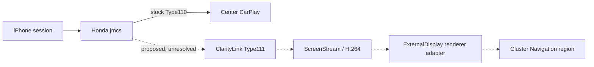

# ClarityLink roadmap

**Goal:** preserve stock Honda CarPlay on the center display while adding an independent navigation stream in the instrument cluster's existing Navigation region. Apple Maps is the first target; Waze is conditional on negotiated secondary-screen support. Preserve all other stock safety and cluster UI.

## Current engineering stage

The active executable work is the offline digital twin. Step 42J exercises generated synthetic H.264 through the modeled ScreenStream parser, AVCC-to-Annex-B extraction, FFmpeg decode, and a mock Display 1 renderer. This validates a host-side synthetic pipeline only.

## Evidence-backed target

The target architecture keeps Honda Type110 stock and adds a separate Type111 path inside/alongside the CarPlay session owner, with a renderer adapter in the ExternalDisplay host. Those integration seams remain unproven for Honda.

## Workstream and gates

| Workstream | Current state | Next gate |
|---|---|---|
| Offline digital twin | Ready for modeled/synthetic behavior | Optional in-memory RGBA preview based on the Step 42J decoded frame |
| Honda `/info` and Type111 schema | Type110 confirmed; stock Type111 skipped; external fields are not Honda facts | Differential audit of the descriptor and control-plane paths |
| Type111 security/session | Honda Type110 KDF inputs known; Type111 reuse unknown | Trace whether a second connection ID can own independent crypto state |
| jmcs integration | No safe proven load seam | Bounded stock-first seam analysis with rollback and exact-build checks |
| ExternalDisplay rendering | Host exists; supported frame handoff not found | Synthetic renderer boundary/proof, then actual host interface evidence |
| Live negotiation | Not ready | Only after control-plane and integration gates; first criterion need not include rendered video |

## Important distinction

Apple, xcertplay, MHI2, and CPC200 establish external architecture or receiver-specific prior art. They do not prove Honda behavior. See the [source-pinned research](docs/research/carplay-altscreen-prior-art.md), [Honda research plan](docs/research/honda-type111-research-plan.md), [project state](PROJECT_STATE.md), and [next action](NEXT_ACTION.md).

## Invariants

- Stock Type110 response, data path, crypto state, center display, and audio remain unchanged.
- Type111-only failure must clean up Type111-owned resources only.
- Synthetic and external-prior-art fields retain their evidence labels.
- Live Type111 and jmcs no-op loading remain NOT READY until their explicit gates pass.
