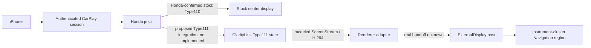

# ClarityLink architecture

## Goal

Keep factory CarPlay on the Honda Clarity center display while adding an independent navigation stream to the instrument cluster's existing Navigation region. Apple Maps is the initial target; Waze is a later target only if the negotiated secondary-screen behavior supports it. Other stock safety and cluster content must remain intact.

## Evidence-backed architecture boundary

Apple documents independent vehicle-system CarPlay display streams. Honda's archived receiver evidence confirms its Type110 path and confirms that unsupported Type111 is currently skipped. The architecture below is therefore a target, not a working Honda Type111 implementation.

## Invariants

- Honda stock Setup runs first in the target design.
- Type110 response, listener, crypto state, display behavior, and audio remain stock-owned.
- Type111 state is independent; its failure must not disturb Type110.
- Current Type111 response fields, display correlation, security behavior, and iPhone trigger are unknown for Honda.
- The offline twin's H.264 media and renderer frames are synthetic values; they do not prove Honda wire acceptance or the ExternalDisplay handoff.

## State separation hypothesis

Keep three candidate domains separate: (1) Type111 transport/listener lifetime, (2) UI ownership and selected content, and (3) ViewArea/cluster geometry. This decomposition is informed by external MHI2 prior art and is a `HYPOTHESIS` until Honda evidence verifies it.

## Pointers

- [Source-pinned prior art](../research/carplay-altscreen-prior-art.md)
- [Honda-specific research plan](../research/honda-type111-research-plan.md)
- [Current state](../../PROJECT_STATE.md)
- [Next technical action](../../NEXT_ACTION.md)
