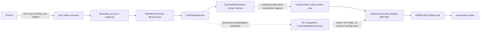

# 2018 Clarity CarPlay and instrument-cluster static analysis

**Scope:** MY16ADA, Android 4.2.2, build 1.F1A2.45. This is analysis of the copied backup and parked captures on September 18 and 25. A no-permission decoder diagnostic APK was temporarily installed with user approval on September 25, then removed and its absence verified; no firmware or system component was changed. The live car has demonstrated CarPlay casting with audible Apple Maps directions; it has **not** demonstrated an independent CarPlay map stream or native Apple Maps maneuver fields.

For the subsequent internet research, Volvo-style target, September 18 capture, and exact native-integration requirements, see [NATIVE_CARPLAY_CLUSTER.md](NATIVE_CARPLAY_CLUSTER.md). Apple's [WWDC19 session](https://developer.apple.com/videos/play/wwdc2019/252/) distinguishes iAP2 Route Guidance metadata from multiple cluster H.264 streams and states that the latter required R15 CarPlay Communication plug-in APIs. The existing Honda build's second **Android** display does not by itself meet those receiver requirements.

The current staged work and its evidence gates are in the [second-display execution plan](plans/SECOND_DISPLAY_EXECUTION.md) and the [post-diagnostic native implementation gates](plans/NATIVE_CLUSTER_IMPLEMENTATION_GATES.md). The September 25 [session findings](captures/20260925T150706Z-SESSION_FINDINGS.md) include live casting and Music captures, a physical-cluster reference photo, kernel capability survey, and an approved decoder test. The Mac simulator replays those observed frames as well as a proposed cluster-stream contract and an explicitly hypothetical route-metadata fixture. The latter are bench models, not native CarPlay receiver support.

A later September 25 [head-unit Waze survey](captures/20260925-WAZE_HEADUNIT_FINDINGS.md) captured a distinct, semantic cluster arrow/distance while Waze ran directly on Android. The arrow persisted when the center switched to Honda Home and cleared to compass when the route ended. This confirms the existing cluster renderer can stay independent of the center image; it does **not** show iPhone CarPlay navigation metadata or a dedicated CarPlay map stream.

The [deep diagnostics blueprint](plans/DEEP_DIAGNOSTICS_BLUEPRINT.md) separates iAP2 Identification, CarPlay display negotiation, and actual decoded-frame capacity. The live kernel has `CONFIG_USB_MON` unset, closing the prepared [usbmon text summarizer](scripts/usbmon_summary.py) path on this device; raw packet contents remain unknown. The [signed Android API-17 decoder probe](probes/decoder-capacity/README.md) ran two NVIDIA H.264 instances with actual 800×480 output frames, then was removed. Its foreground Activity did not test coexistence with visible center CarPlay.

An additional read-only, root-scoped process inventory produced a [live receiver topology](native/live-session-topology-20260925.md): `jmcs` had active iAP2 and AirPlay audio threads, `libcarplay_proxy.so` mapped, USB and Binder handles, an ALSA playback handle, and two established IPv6 TCP flows to one peer. Live Binder records show the CarPlay service bound to Navigation and ExternalDisplay services. These are component and transport observations, **not** decoded CarPlay route or second-display capability messages. Raw endpoint details stay in local captures.

## 0. Evidence, integrity, and limits

The pristine directory is `/Users/bmreyes24/ClarityLab/backups/CLARITY_BACKUP_20260918_0225_ORIGINAL`. Every one of its 38 entries lacked owner/group/other write bits and was not writable by the current account at the start of this analysis. All nine named backup payloads matched `SHA256SUMS` in both pristine and analysis copies (18 checks). See [permission inventory](inventory/pristine-permissions.json) and [checksums](inventory/backup-checksums.json). These permissions are a safeguard, not filesystem immutability; no permission or byte in the pristine directory was changed. The USB copy was located at `/Volumes/CLARITY/CLARITY_BACKUP_20260918_0225` and read only. The backup contains live file archives, boot/recovery/NOR images, and only the first 4 MiB of eMMC, **not** a complete raw eMMC image or an established restore procedure. That distinction matters before any later firmware change.

The factory APKs and ODEX files were extracted from the **analysis copy** of `system-vendor.tar`. Direct JADX decompilation of the optimized ODEX gave invalid quickened instructions. I deoptimized with baksmali using the copied Android 4.2.2 framework, reassembled DEX, then ran JADX. [Deodex results](logs/deodex-results.json) identify all 15 targets. One `MediaCoreService` class had two JADX errors; its smali remains available. Resources and manifests were decoded with apktool; [resource results](logs/resources-results.json) show five successful decodes. Native ARM32 ELF symbols, strings, and instruction listings are in [native](native/). The requested search terms and line counts are in [search summary](search/search-summary.json), with factory Java, Honda Hack Java, resource XML, and native hit files adjacent. Hits alone are not proof of a feature: the same library includes Android Auto and emergency-call symbols.

Tools were stored inside `research/tools`: JADX 1.5.6, apktool 3.0.3, baksmali/smali 2.5.2, Java 17, pyelftools and Capstone. Ghidra was not installed because the available symbols and targeted disassembly suffice for initial triage. [Native triage script](scripts/native_triage.py) records binary SHA-256 and dependencies. The annotated disassembly is a *heuristic* linear read of Thumb code; branch targets and ELF symbols are stronger evidence than its inferred register values.

## 1. CarPlay component map

`CarPlay.apk` contains the foreground UI. `CarPlayService.apk` contains `CarPlayApService`, display, ownership, navigation-status, and audio control. Both manifests are in [decoded resources](resources/). `CarPlayService` declares external-display and navigation shared libraries, but [NavigationControl.java](decompiled-clean/CarPlayService/sources/com/mitsubishielectric/ada/appservice/carplayapservice/NavigationControl.java) holds **native-navigation route arbitration** and ownership state, not maneuver text or distance. Its [DisplayConfig.java](decompiled-clean/CarPlayService/sources/com/mitsubishielectric/ada/appservice/carplayapservice/data/DisplayConfig.java) is brightness/contrast/tint/density configuration, not a secondary-display advertisement. `CarPlayApServiceApiLib.jar` provides the Binder API, and `MediaCoreService` exposes the iAP initialization width/height fields in [IapInitialInfo.java](decompiled-clean/MediaCoreService/sources/com/mitsubishielectric/ada/framework/mcservice/IapInitialInfo.java).

The actual receiver engine is copied `system/bin/jmcs` (SHA-256 `cbc7ba881648fb8ffdfcc4c1100a028345c37134a2ae3b9dff7d76572851c232`), which links `libcarplay_proxy.so` (SHA-256 `dc8bc5c19cf32a8e7edcc14c1d80e78bb96ca6ccc434229349c74590136bef66`). `jmcs` has 33,662 ELF symbols, including `mc_carplay_app_init`, `mc_carplay_screen_stream_init_instance`, `mc_ScreenStreamProcessData`, and iAP2 identification. The proxy exports screen/audio callback glue, not a stand-alone second map implementation. See [native symbol inventory](native/jmcs/symbols.json), [proxy symbols](native/libcarplay_proxy.so/symbols.json), and [focused disassembly](native/jmcs/focused-annotated.txt). All native offsets below are ELF virtual addresses; Thumb function symbols have low bit set, while the instruction begins at address & ~1.

## 2. External-display component map

`ExternalDisplayApService.apk` is the Binder/control side. Its [InterfaceCpuCom.java](decompiled-clean/ExternalDisplayApService/sources/com/mitsubishielectric/ada/appservice/externaldisplay/InterfaceCpuCom.java) forwards LVDS displaying status and interrupt requests to `ICpuComService`. `ExternalDisplayOutService.apk` is the graphical side. [ExternalDisplayOutService.createWindow](decompiled-clean/ExternalDisplayOutService/sources/com/mitsubishielectric/ada/app/externaldisplay/ExternalDisplayOutService.java) at lines 992–1022 enumerates Android displays, selects the last display, creates a display context, and sets `InterfaceWindow`'s window manager. It subscribes to navigation callbacks around lines 361–364 and passes maneuver/status messages into its handler. `ExternalDisplayLib.jar` defines the service interfaces. This establishes a normal Android-rendered second display.

The earlier read-only display dump reports two independent 800×480 display devices: built-in center display, and `HDMI Screen` (layer stack 1, type HDMI), both near 60 Hz. See `outputs/captures/20260918T021654974130Z-honda-hack-casting/display.txt` in the prior Codex workspace. The two saved frames copied into [simulator](simulator/) show center CarPlay and the secondary-display cast embedded above the factory `Menu` area. User observed live cluster mirroring and spoken guidance.

## 3. Graphical frame transport and meter communications

The supported path from static and captured evidence is **Android Surface → HDMI display device → physical cluster link**. The exact electrical path after HDMI and the display serializer chip are not proven from these archives. `system/vendor/bin/disp_com_meter` is a separate display-link control daemon. Its [strings](native/disp_com_meter/keyword-strings.txt) identify `/dev/i2c-0`, serializer/deserializer checks, HDCP, handshake, power/interrupt functions, and `/dev/socket/DispCom_Meter_MsgServiceToDaemon` plus `MsgDaemonToService`. The daemon imports FIFO creation and file I/O; these paths carry control messages. There is no evidence that 800×480 pixel frames travel through those FIFO paths. The exact carrier of rendered pixels beyond the Android HDMI device remains an inference from display enumeration and live casting.

`system/bin/cluster`, `cluster_get.sh`, and `cluster_set.sh` read/write `/sys/kernel/cluster/*`. Their name alone does **not** identify the instrument-cluster transport; it likely refers to a kernel CPU cluster facility. Do not execute or repurpose them for this project without independent kernel evidence.

## 4. Honda Hack implementation

The installed package `cn.autohack.hondahack` was extracted from the **analysis copy** of `userdata-live.tar` as [HondaHack APK](extracted/cn.autohack.hondahack-2.apk), SHA-256 `5013b478ddd95b01d8f3866fa533d2cd2da5629d6bb609c03c3d816e836afb73`. Its APK was decompiled by JADX and apktool. It uses Xposed hooks; hook target names were encrypted in `Hb.java`, so the [static string decoder](scripts/decode_hondahack_strings.py) recovered all 283 names using bytes from the backed-up modified `app_process`. [Decoded names](search/hondahack-hook-targets.json) and [annotated hook source](search/HondaHack-hooks-annotated.java.txt) make the obfuscated flow auditable without running vehicle code. The extracted Xposed bridge's native `decrypt` method accounts for the obscured names. Only backup copies were inspected.

**Casting path, high confidence:** [ne.java](decompiled/cn.autohack.hondahack-2/sources/cn/autohack/hondahack/ne.java) reflects `Surface.nativeScreenshot` on API 17, captures built-in display 0 at **400×240**, and writes **384,000 bytes** of ARGB pixels to `MemoryFile("screen_cast_bitmap")`. It duplicates the file descriptor into a `Messenger` bundle (`pfd`) from the hooked SystemUI screenshot service. [C0170b.java](decompiled/cn.autohack.hondahack-2/sources/cn/autohack/hondahack/C0170b.java) binds that service, receives the shared-memory pixels, and forwards a `Bitmap`. [C0270ua.java](decompiled/cn.autohack.hondahack-2/sources/cn/autohack/hondahack/C0270ua.java) inserts a custom `AbsoluteLayout` into `InterfaceWindow` and calls `ImageView.setImageBitmap` at line 1075. [Be.java](decompiled/cn.autohack.hondahack-2/sources/cn/autohack/hondahack/Be.java) requests updates every `1000/screen_cast_quality` ms; the saved preference value 12 is a requested cadence of roughly 12 Hz, not measured final FPS. This explains why live casting works and why it is a compressed/scaled mirror rather than an iPhone-rendered second surface.

**Advanced meter/navigation path, high confidence:** `C0170b` hooks `InterfaceWindow.getMainLayout/getInterruptLayout` and inserts `C0270ua`; it also hooks `ExternalDisplayOutService.AndroidAutoServiceCallBack` methods `onNotifyNavigationStatus`, `onNotifyNavigationNextTurn`, and `onNotifyNavigationNextTurnDistance`. The original callback contract is visible at lines 2514–2554 of [ExternalDisplayOutService.java](decompiled-clean/ExternalDisplayOutService/sources/com/mitsubishielectric/ada/app/externaldisplay/ExternalDisplayOutService.java): handler codes **5601/5602/5603**. `C0170b` uses matching handler messages and `notifyLvdsInterrupt(66)` to take visual priority. `C0270ua` also listens for `START_NAVI`, `STOP_NAVI`, and `UPDATE_NAVI_WAZE` broadcasts. The Waze hook names refer to the **Android Waze app**, not Waze running inside iPhone CarPlay. The current Honda Hack preference combination gates its native guidance overlay when screen casting is enabled.

**Audio path:** Honda Hack also Xposed-hooks `AudioSourceSelector`, `AudioPath.openNaviPath`, audio focus, and audio track checks when `enable_nav_audio_compatible_mode` is enabled; see [C0168ad.java](decompiled/cn.autohack.hondahack-2/sources/cn/autohack/hondahack/C0168ad.java) and adjacent hooks. Therefore working voice was empirically verified by the user for the present configuration, but audio behavior after any new hook or receiver change cannot be assumed. The casting pixel path itself is separate from audio transport.

The backed-up [public preferences](extracted/hondahack-prefs/public.xml) select `car_model=clarity`, `enable_custom_meter=true`, `nav_in_dashboard=true`, `enable_nav_audio_compatible_mode=true`, and `screen_cast_quality=12`. The backup's final `enable_screen_cast` value is **false**; the earlier live casting session occurred before it was turned off. `C0270ua.getMeterLayout()` maps `clarity` to [meter_civic.xml](resources/HondaHack/res/layout/meter_civic.xml), which has separate `navi_layout`, `turn_icon`, `next_road`, and `screen_cast_layout` views. Its `UPDATE_NAVI_WAZE` handler accepts `icon`, `distance`, `distUnit`, `street`, `bottomTime`, and `bottomDist` extras and resolves `icon` to a bundled drawable. `start`, `left`, `right`, and `forward` are among the known icon names. This is a concrete display-only candidate when casting is off; no iPhone Waze link is implied.

**Live Waze mode differs from the old backup:** On September 25, live `public.xml` reported `nav_in_dashboard=true`, `enable_custom_meter=false`, and `enable_screen_cast=true`. With Waze installed on the head unit, Honda Hack's `C0288xd` Xposed hook on `com.waze.NavBarManager.set_distance` read Waze's maneuver/distance fields. The `enable_custom_meter=false` branch sent `UPDATE_NAVI` broadcasts into `C0170b`'s 5601/5602/5603 external-display handler path. A separate arrow/distance appeared on HDMI and the physical cluster, persisted over Honda Home, then cleared to compass when the route stopped. See the [survey](captures/20260925-WAZE_HEADUNIT_FINDINGS.md). This live path is a better renderer reference than the dormant custom `UPDATE_NAVI_WAZE` path, but its source is Android Waze, not CarPlay.

The [offline native-guidance adapter](simulator/native_guidance_adapter.py) now models the verified 5601/5602/5603 contract and rejects a maneuver when distance is unknown. The saved Apple Maps frame has street/banner text but no next-maneuver distance, so it cannot yet drive the observed Waze-style view faithfully. The adapter sends no ADB command; it is a test fixture for a future source of reliable CarPlay maneuver data.

The Waze capture also exposed a **factory layout limit**. `TurnByTurnController.androidAutoTBTDataConvert` stores the road string but maps normal start and turn events to views 61441/61442, whose `createAndroidAutoViewTypeB/C` methods do not draw it. Only the special 61445/E2 view uses `getAndroidAutRoadName()` in `setText`. This matches the user's physical observation of arrow/distance without street text. The proven 5601–5603 renderer therefore cannot deliver all Goal 1 fields by itself; a separate bounded custom view is needed for street names.

Honda Hack's proven casting path uses Binder/Messenger and shared memory plus Android display rendering. No evidence in that path shows a direct pixel `ioctl` to a framebuffer, pixel socket, or direct CAN write. Its display arbitration does call LVDS service methods; those should be regarded as display control, not a general permission to send vehicle-bus messages.

## 5. Factory navigation path

[ITBTInformation.java](decompiled-clean/HondaNavigationLib/sources/com/honda/displayaudio/system/meter/ITBTInformation.java) exposes Binder methods to register callbacks, set guide-display demand, set next-road guidance, set current road, and set navigation status. The data objects [NavGuide](decompiled-clean/HondaNavigationLib/sources/com/honda/displayaudio/system/meter/NavGuide.java) and [GuideDispDemand](decompiled-clean/HondaNavigationLib/sources/com/honda/displayaudio/system/meter/GuideDispDemand.java) contain arrow direction, road name and encoding/count, lane data, remaining distance, units, scale, and status. [ExternalDisplayOutService's TBT callback](decompiled-clean/ExternalDisplayOutService/sources/com/mitsubishielectric/ada/app/externaldisplay/ExternalDisplayOutService.java) at lines 2387–2426 forwards these semantic data to the cluster renderer. Thus the factory navigation UI can represent most Goal 1 fields.

**Critical boundary:** [TBTInformation.java](decompiled-clean/Navigation/sources/com/honda/displayaudio/system/meter/TBTInformation.java) at lines 226–344 conditionally calls `setGuideDispDemandToBCan`, `setNavGuideToBCan`, and `setNavCurrentToBCan`; the first reaches `requestBcanGuideDispDemand` near line 533. The condition depends on model and status. These setters are **not safe display-only test hooks** under the user's no-CAN rule. The existing Android Auto handler 5601/5602/5603 is a *possible* visual-only integration seam, but must be proven isolated in a simulator and then reviewed before any on-car use. Honda Hack's current Waze adapter is evidence of reuse, not evidence that CarPlay supplies the same data.

## 6. CarPlay secondary display: evidence and limits

The receiver's `mc_carplay_app_init` (`jmcs` VA **0xaff09**) calls `ScreenCreate` once at instruction **0xaffd2**, sets properties, then calls `ScreenRegister` at **0xb02aa** for `gMainScreen` (global VA **0x3564ac**). `screen_add_props` (VA **0xabd51**) reads `CarPlay/ScreenProperties/VIDEO_WIDTH_PIXELS`, `VIDEO_HEIGHT_PIXELS`, `TOUCH_MODE`, and `MAX_FPS`. [`AirPlayReceiverSessionScreen_CopyDisplaysInfo`](native/jmcs/focused-annotated.txt) (VA **0x287ae1**) calls `ScreenCopyMain` at **0x287b0c** to build advertised display information. Although the generic screen library maintains an array and screen-stream counter, this car-specific initialization shows **one configured main screen**. A generic counter does not prove two active video displays. The model XML reports `ScreenWidth=800`, `ScreenHeight=480`, `CarPlayDisplay=0x08`, `IsExtDisplay=0x02`, and `IsExtCentrDisplay=0x02`; the bit meanings were not found, so none is labeled a hidden cluster enable switch.

The subsequent [focused receiver audit](native/receiver-multidisplay-audit.md) found a second concrete blocker: `libcarplay_proxy.so` `mc_carplay_proxy_screen_register` (VA **0x1b7d**) keeps one global screen callback structure and rejects a second registration once its flag is set. The generic `ScreenRegister` appends to an array, but `ScreenCopyMain` selects index 0 for advertised display information. Thus registering one more generic screen would not by itself provide a second negotiated stream or an Android sink. The copied `j_config.xml` configures the existing 800×480 CarPlay screen for **30 FPS**. The September 25 probe produced 28/30 800×480 frames from **each of two simultaneous NVIDIA H.264 decoder instances** in 1973 ms, with both EOS flags set. Its strict 30-frame criterion was incomplete; CarPlay coexistence and second-stream negotiation remain unmeasured.

**Assessment:** there is positive evidence for a usable *Android* second display and a generic receiver screen library, but no static evidence that this firmware advertises a dedicated CarPlay instrument-cluster display or creates a second CarPlay video decoder/surface. Confidence **high** for the single configured main screen in `mc_carplay_app_init`; **medium** for the conclusion that a dedicated stream is absent, because protocol configuration and dynamic behavior need a read-only iAP2/receiver trace to settle it. No capability bit should be flipped on the car based on this static scan. Apple's current CarPlay documentation says supported cars can offer navigation in a cluster, and its simulator has an explicit second display: [CarPlay](https://developer.apple.com/carplay/), [WWDC22 simulator session](https://developer.apple.com/videos/play/wwdc2022/10016/). That describes possible CarPlay systems, not evidence that MY16ADA implements it.

| File / class or symbol | Offset / line | Observed value or behavior | Likely purpose | Confidence |
|---|---:|---|---|---|
| `jmcs` / `mc_carplay_app_init` | VA `0xaff09`; calls `0xaffd2`, `0xb02aa` | Creates/registers `gMainScreen` once | Main CarPlay display registration | High |
| `jmcs` / `screen_add_props` | VA `0xabd51` | Reads width, height, touch, max FPS | Main screen capability values | High |
| `jmcs` / `AirPlayReceiverSessionScreen_CopyDisplaysInfo` | VA `0x287ae1`; call `0x287b0c` | Calls `ScreenCopyMain` | Display information sent into session | Medium-high |
| `jmcs` / `mc_ScreenStreamInitialize` | VA `0xbec19` | Maintains stream count | Generic receiver stream lifecycle, not proof of multiple active displays | Medium |
| `CarPlayService` / `NavigationControl` | Java lines 8–108 | Tracks native route/ownership state | Navigation resource arbitration | High |
| Model configuration / `modelinf.xml` | `ScreenWidth`, `CarPlayDisplay`, `IsExtDisplay` | 800×480, `0x08`, `0x02` | Unit capability/configuration flags; bit meanings unresolved | Low for any second-CarPlay interpretation |

## 7. Route guidance metadata: evidence and limits

Apple described next-turn metadata for secondary displays in iOS 10, separate from the main video stream: [Developing CarPlay Systems, Part 2](https://developer.apple.com/videos/play/wwdc2016/723/). In this firmware, the string `turn_by_turn` appears in `jmcs` near `mc_carplay_app.c` resource-state parsing, alongside `screen_state`, `main_audio_state`, and `turnByTurn`/`turn_by_turn_owner`. That supports **turn-by-turn resource/ownership arbitration**; it is not a decoded maneuver, road name, or distance callback. The September 18 reconnect log likewise changes from `turns n/a` to `turns controller` without printing any road, maneuver, or Route Guidance payload. The CarPlay Java service's `NavigationControl` tracks native route ownership. Native `handle_carplay_e911_guidance_start/stop` means emergency-call guidance/audio behavior and must not be interpreted as map maneuver support. The native Honda and Android Auto paths do decode maneuvers, but no CarPlay-to-Honda callback was found in the inspected binaries/classes. Confidence **medium** that this build does not already bridge Apple Maps metadata; confidence **low** about whether iPhone metadata is offered but ignored, because the ordinary reconnect log is not a full iAP2 control trace.

## 8. Most promising modification points, in order

1. **Display-only guidance prototype:** Keep the current CarPlay center display and audio untouched. Read the center screenshot and identify the Apple Maps top guidance card. The [guarded Mac bridge](simulator/clarity_guidance_bridge.py) currently produces an offline `UPDATE_NAVI_WAZE` plan for the **custom-meter** view, with `STOP_NAVI` rollback. The live September 25 car instead selected `enable_custom_meter=false`, where Android Waze successfully used `UPDATE_NAVI` and the factory external-display handler. The existing bridge now refuses live execution under that observed setting; its custom-view branch has not been tested on this car. The next offline prototype should target the proven 5601/5602/5603 view and validate an exact maneuver/distance mapping before a separately reviewed parked test. The Mac [OCR extractor](simulator/GuidanceOCR.swift) recovered `Start on Example Rd`, [GuidanceCard.swift](simulator/GuidanceCard.swift) made a cropped card, and the [digital twin](simulator/index.html) replays observed Waze and casting states. Any image-derived route is an interim implementation, **not** true CarPlay secondary display.
2. **Metadata bridge, only if observed:** Read-only trace of `jmcs`/CarPlay service during an Apple Maps turn, comparing native-navigation and CarPlay sessions. If actual CarPlay maneuver fields can be established, map them into a *display-only* overlay, not `ITBTInformation` setters that can send B-CAN. Native `jmcs` parsing or a narrow Binder callback are possible sites, but no callable contract is verified yet.
3. **Independent secondary CarPlay map:** Investigate an additional screen advertisement and second ScreenStream decoder/surface only after a read-only receiver/iPhone negotiation capture and a simulator reproduction. `mc_carplay_app_init`, `screen_add_props`, `AirPlayReceiverSessionScreen_CopyDisplaysInfo`, and `libcarplay_proxy` screen callbacks are relevant. This is a **substantial receiver change**, not a one-bit configuration change. The factory cluster's exposed Android display provides a rendering destination, but physical display layout and safe areas still need measurement.

The Waze-style external-display handler is now a verified rendering path, but the proposed CarPlay screenshot-to-guidance bridge is **not car-ready**. It needs a mapping that matches the live `enable_custom_meter=false` mode, a stale-guidance clear rule, and a reviewed test card. The receiver and firmware candidates also are not car-ready patches. No factory APK, ODEX, native binary, init file, or vehicle setting has been modified. A final firmware artifact would need exact file hashes, a byte-level diff, restore steps, and a tested rollback. The backup alone does not establish that restoring a failed boot is possible.

## 9. Risks and exclusions

The factory navigation setters can produce B-CAN traffic. Do not call them. Do not touch CAN/B-CAN/F-CAN, ADAS, braking, steering, airbags, warning lights, or instrument readouts. Keep any future experiment constrained to the **navigation area** of the already proven Android second display; avoid covering speed, warning, or telltale regions. Image-based reading can misidentify a turn, show stale guidance, or lag; it must clear on disconnect, app switch, loss of confidence, or timeout. In the simulator, disconnect clears route state. Native receiver patching could prevent CarPlay or unit boot and cannot yet be justified. Voice preservation requires live observation after a future authorized install; the current user-verified working state is the baseline. Log and frame captures can contain route or phone identifiers and should remain local.

`CarPlay Ultra` would require a larger car/phone integration than merely rendering on Android display 1. No Ultra negotiation evidence was found. Spatial Audio/Atmos is deferred until navigation and audio routing are understood. Neither should be advertised as available on this firmware.

## 10. Next read-only tests on the actual car

The September 18 parked session captured a fresh CarPlay reconnection, an active Apple Maps route, center-screen Music while the route continued, and center/HDMI screenshots. The HDMI output stayed on Honda's compass/Menu region; no independent map or turn card appeared. `MemTotal` was `984580 kB` (approximately 1 GB). The ordinary logs exposed CarPlay resource ownership but not iAP2 identification payloads or a second video setup. Read-only process maps were denied to the unprivileged ADB shell; the Android build has no `media.codec` dumpsys service. See the [capture notes](NATIVE_CARPLAY_CLUSTER.md#september-18-parked-read-only-capture) and [sanitized events](captures/20260918T153910Z-native-cluster-readonly/carplay-events-sanitized.txt).

The September 25 [parked session](captures/20260925T150706Z-SESSION_FINDINGS.md) captured casting off/on and a center Maps → Music switch. With casting off, HDMI showed the Honda compass; with casting on, it mirrored Maps, then mirrored Music. The user heard spoken guidance while casting and after the decoder-test rollback. The physical photo locates the cast in the NE compass/Navigation region, with exact pixel bounds still unmeasured. `CONFIG_USB_MON` is unset, so the built-in kernel USB monitor is unavailable for iAP2 packet capture. The approved decoder APK ran two NVIDIA decoders concurrently for actual frames, then was fully removed; normal CarPlay, voice, and cluster behavior were verified. The next packet diagnostic requires a different, separately reviewed observation method; ordinary logcat silence still does not prove capabilities absent.

The later [Waze-on-head-unit capture](captures/20260925-WAZE_HEADUNIT_FINDINGS.md) established a positive control for **independent semantic guidance**: center Waze → center Honda Home left the cluster's 300-foot arrow frame unchanged; stopping the route restored the native compass. The physical cluster showed the arrow and distance but no street name. A Mac-to-head-unit USB cable did not enumerate a wired ADB device; Wi-Fi ADB remained the only listed transport. These results narrow the rendering problem but do not reveal iAP2 Identification or CarPlay secondary-display negotiation.

The [next parked-session card](plans/NEXT_CAR_SESSION.md) lists the Mac-side capture prerequisites and the short car procedure. Until a payload-preserving inline capture method is tested, another ordinary ADB session would repeat evidence already collected.

## 11. Proposed Mac simulator and what already works

The local [digital twin](simulator/index.html) renders a schematic navigation area and replays JSONL events with connection, guidance, voice observation, casting state, and synthetic speed/gear/SOC/EV range. [Replay model](simulator/digital-twin.js) validates fields, rejects out-of-order events, and clears guidance on disconnect. [Sample log](simulator/sample-replay.jsonl) uses the saved Apple Maps OCR text and explicitly marks the unknown maneuver/distance as placeholders. [GuidanceOCR.swift](simulator/GuidanceOCR.swift), compiled with macOS Vision on the M3 Mac, processed the captured 800×480 frame and produced [OCR evidence](simulator/fixture-ocr.json). [GuidanceCard.swift](simulator/GuidanceCard.swift) cropped the actual arrow and road banner into [guidance card](simulator/fixture-guidance-card.png). `node` replay checks and the OCR-to-Honda-Hack dry-run plan passed. The browser prototype reads a local event file and has no vehicle I/O. Open `simulator/index.html` and choose a JSONL file; a local HTTP server is needed only for its bundled sample button.

An added [independent-screen example](simulator/sample-dual-screen.jsonl) models the missing receiver contract: cluster capability advertisement, separate setup, activation, frames that persist while center CarPlay switches from Maps to Music, route-end clearing, and disconnect cleanup. The [test](simulator/test-dual-screen.js) passes and rejects cluster setup when the capability was not advertised. Its CSS map is explicitly synthetic; it is not a decoded iPhone stream or proof the Honda receiver supports one.

The [captured two-display replay](simulator/index.html) now shows both the earlier parked session and September 25's native-compass → mirrored-Maps → mirrored-Music sequence. [Working copies](simulator/working-backup/) of `j_config.xml` and Honda Hack's `meter_civic.xml` supply a generated [display profile](simulator/display-profile.json): 800×480 main stream at configured maximum 30 FPS and a 584×215 Honda Hack meter layout. The [physical Maps](simulator/assets/physical-maps-20260925.jpg) and [Music](simulator/assets/physical-music-20260925.jpg) photos show the cast filling the center region below speed and above Menu/trip. Speed and range remain visible; the sides approach power/charge markings, so exact safe bounds remain unmeasured. The simulated maneuver preview remains separate from observed HDMI frames. [Simulator notes](simulator/README.md), [construction plan](plans/cluster-integration.plan.md), and [ADR-0001](adr/0001-firmware-copies-and-display-twin.md) record scope and decisions. The pristine original backup remains read-only and unchanged.

A separate [head-unit Waze replay](simulator/sample-waze-headunit-20260925.jsonl) uses five copied frames for Waze foreground, Honda Home with the same HDMI arrow, and route-end compass. Its [test](simulator/test-waze-headunit-replay.js) checks that the cluster frame is byte-identical across the center-app switch and differs after the route ends. The simulator button **Load head-unit Waze guidance** shows this measured behavior beside the CarPlay casting example; it does not imply an iPhone metadata feed.

The [infotainment twin scope and evidence matrix](simulator/INFOTAINMENT_TWIN_SCOPE.md) distinguishes measured display states, voice observation, and synthetic vehicle values. The tested [offline survey comparator](scripts/twin_survey_compare.py) records hashes and relevant display/audio line changes while retaining unknown ownership as unknown. The September 25 replay now provides a current-behavior oracle for the [native implementation gates](plans/NATIVE_CLUSTER_IMPLEMENTATION_GATES.md). For the next simulator iteration, add adapters for saved Android logcat records and carefully labeled protocol traces; build a 400×240 crop/arrow recognizer with confidence thresholds and stale-data expiry; keep audio as observation only. Validate Apple Maps and Waze separately. This is an infotainment model, not a full-car or safety-system emulator.

## Decision

The present car has a **working mirrored CarPlay view with spoken directions**. September 25 directly showed that the mirror follows the center from Maps to Music. Two NVIDIA decoder instances can produce concurrent actual frames under the tested fixture, but the receiver still has only one proven CarPlay display path. There is **no verified dedicated CarPlay cluster map or tested on-car guidance bridge**. The [implementation gates](plans/NATIVE_CLUSTER_IMPLEMENTATION_GATES.md) prioritize a separately observed receiver protocol contract, an offline two-stream model, bounded rendering in the NE Navigation region, and a reversible receiver change only after those gates. The pristine original backup remains untouched; the sole temporary diagnostic APK was removed and baseline CarPlay/voice restored.
