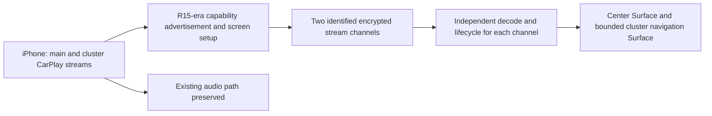

# Honda receiver multi-display audit (offline)

**Scope:** copied MY16ADA build 1.F1A2.45 binaries and the September 18 read-only capture. No vehicle patch or changed file is proposed here. ELF addresses below are virtual addresses in the copied binaries. Thumb function symbols have the low bit set; disassembly starts at the address with that bit cleared.

**September 25 addendum:** an approved, temporary decoder probe produced 28 actual 800×480 output frames from each of two simultaneous `OMX.Nvidia.h264.decode` instances in 1973 ms; both reported EOS, but the 30-frame pass threshold was not met. This narrows the hardware-capacity uncertainty without proving CarPlay coexistence or multi-display negotiation. The kernel has `CONFIG_USB_MON` unset, so raw iAP2 payloads were not obtained by built-in USB tracing. Honda Hack's live cast followed center Maps → Music; physical photos place it in a central area below speed and above Menu/trip, with side clearance still to verify. See [session findings](../captures/20260925T150706Z-SESSION_FINDINGS.md). The historical pre-test paragraphs below describe what was unknown at the time of static inspection.

## Target contract

[Apple's WWDC19 CarPlay systems session](https://developer.apple.com/videos/play/wwdc2019/252/) describes separate H.264 cluster map and maneuver-card streams, independent view/safe areas, and the need to adopt CarPlay Communication plug-in R15 APIs for those iOS 13 capabilities. [WWDC23](https://developer.apple.com/videos/play/wwdc2023/10150/) distinguishes CarPlay navigation UI streams in the cluster from iAP2 metadata drawn by a vehicle's own UI. This audit addresses the **stream** path required for the Volvo-style map, not just turn text.

## Receiver and proxy evidence

| Component | Exact evidence | Implication | Confidence |
|---|---|---|---|
| `jmcs` car-specific initialization | `mc_carplay_app_init` VA `0xaff09` calls `ScreenCreate` at `0xaffd2`, then `screen_add_props` and `ScreenRegister` for `gMainScreen` at `0xb02aa`. No second car-specific registration was found in this initialization. | One configured CarPlay screen in this build. | High |
| Generic screen registry | `ScreenRegister` VA `0x2a1891` appends to `gScreenArray` using `CFArrayAppendValue` at `0x2a18be`. | The underlying registry can contain more than one object; this does **not** make the Honda integration multi-display. | High |
| Advertisement | `AirPlayReceiverSessionScreen_CopyDisplaysInfo` VA `0x287ae1` calls `ScreenCopyMain` at `0x287b0c`. `ScreenCopyMain` VA `0x2a17fd` retrieves array index 0. The inspected function does not iterate the registry to emit separate screen entries. | The current response builds its display information from the main screen. A second `ScreenRegister` call alone would not establish a second advertised cluster display. | Medium-high |
| Honda screen callback proxy | `libcarplay_proxy.so` `mc_carplay_proxy_screen_register` VA `0x1b7d` reads a global registration flag at `0x1ba2`–`0x1baa`. If it is already set, the function exits at `0x1bce` or `0x1c10` with `0x16`; first registration copies a 24-byte callback structure to one global storage area at `0x1be0`–`0x1c04`. The six 32-bit entries are consumed at offsets 0/4/8/12/16/20 by `ScreenStreamInitialize`, `Finalize`, `SetProperty`, `Start`, `Stop`, and `ProcessData`. | The Honda callback path is a **singleton**. A second independent stream needs a redesigned dispatch contract, not merely another callback registration. `0x16` is the observed return value; the exact API-level error name is not established. | High |
| Generic stream lifecycle | `mc_ScreenStreamInitialize` VA `0xbec19` increments `g_screen_streams_cnt` at `0xbec78`–`0xbec80`. | The generic code counts stream instances, but that is not proof that Honda's advertisement, proxy, and Android sink support two concurrent CarPlay displays. | High |
| Feature strings | `jmcs` has legacy `displays`, `maxFPS`, pixel/physical dimensions, and `sourceVersion` keys. A search of its extracted strings found no `viewAreas`, `safeArea`, `initialViewArea`, or `maps:/car/instrumentcluster/map`. | Consistent with a pre-R15 screen integration. String absence alone is not proof that no hidden numeric-key implementation exists. | Medium |
| Live session | The read-only reconnect log showed one named “CarPlay Screen” source and a `turns controller` mode. Ordinary logs did not show a second setup or route payload; the cluster HDMI capture displayed the Honda compass while Maps routed behind center-screen Music. | Confirms the current observed behavior is one center CarPlay image and no Volvo-style cluster map. The log does not reveal the full encrypted/control negotiation. | High for observation; low for packet-level absence |

The underlying CarPlay screen registry and stream counter do not remove the car-specific single-screen and singleton-proxy restrictions. The actual R15-compatible receiver version is not identified in this archive. A capability flag or XML edit is therefore not an evidence-backed patch.

## Decoder and display boundary

`system/etc/media_codecs.xml` lists `OMX.Nvidia.h264.decode` and a Google software H.264 decoder. The running unit reported `MemTotal: 984580 kB`. The copied `libnvomx.so` contains NVIDIA video-decoder resource routines, but it is stripped and no maximum simultaneous decode count was established from exported symbols or readable strings. Current session logs and Android 4.2.2 `dumpsys` supplied no codec-instance count. A 1 GB memory figure does **not** imply exactly one hardware decoder, and guessing 10–15 FPS is not a verified solution. We found no applicable NVIDIA Tegra 3 primary documentation that states a decoder-instance limit for this particular firmware; documentation for newer DRIVE/Jetson chips cannot be transferred to this unit.

The copied [`j_config.xml`](../../extracted/system-vendor/system/vendor/media/mcs/j_config.xml) sets the **main CarPlay** stream to 800×480 and `MAX_FPS=30`. At that configured ceiling, it requests at most 11.52 million picture pixels per second. A *hypothetical* second 800×480 stream at 15 FPS adds 5.76 million, for 17.28 million total; an 800×480 YUV 4:2:0 decoded frame requires about 0.55 MiB before buffering/stride overhead. These arithmetic estimates only bound a possible test configuration. They do not establish that the phone will accept that second rate, that the cluster needs the full HDMI resolution, that the Tegra resource manager permits two decoder instances, or that Android can composite both streams reliably.

Android SurfaceFlinger exposes two 800×480 display devices, built-in and HDMI. Honda Hack already draws content on the HDMI path. The exact physical cluster navigation safe area is smaller than or separate from the full Android output and remains to be measured; display 1 is a destination, **not** evidence of a second iPhone stream. The September 18 screenshots in `research/captures/20260918T153910Z-native-cluster-readonly` show this boundary.

## Required engineering changes for a genuine map

1. **Receiver compatibility:** obtain or implement the newer multi-display communication behavior, including distinct display identities, map view/safe area, stream setup, control, and teardown. Merely adding another entry to Honda's screen registry is insufficient because `CopyDisplaysInfo` selects main.
2. **Proxy contract:** replace the singleton screen callback registration with a per-display or per-stream dispatch path while preserving the current center-screen callback and audio behavior. This is a larger ABI change than a single configuration flag.
3. **Decode and render:** establish whether the old Tegra codec can sustain center plus cluster H.264 streams, or whether a bounded software-decoding path can meet performance and memory limits. Route the cluster image to a surface confined to the noncritical navigation area of Android display 1.
4. **Lifecycle:** independently handle cluster map activation, route end, disconnect, error recovery, and center app changes without stale frames or overlays. Factory warnings, indicators, speed display, and other safety-critical content remain untouched.

The [LIVI source snapshot](../internet/livi-source/src/main/services/projection/driver/cp/stack/getInfo.ts) demonstrates separate main/alternate display entries; its [stack](../internet/livi-source/src/main/services/projection/driver/cp/stack/cpStack.ts) handles type 110/111 setup and distinct video receivers. It is a GPL-3.0 third-party research reference with different platform/authentication assumptions, not a Honda-compatible replacement or an official Apple specification.
Its package scripts target recent Electron/Node on macOS or Linux **arm64/x64**. This Honda runs Android 4.2.2 on **32-bit ARM**, so the application cannot be copied onto the head unit as an APK or dropped in as `jmcs`. Only protocol architecture and test patterns can be studied from it; a Honda-compatible receiver would require separate implementation or a compatible vendor upgrade.

## Decision gate

No native map patch is ready. The proposed receiver/renderer event boundary is recorded in [`cluster-stream-v1.schema.json`](../contracts/cluster-stream-v1.schema.json), with valid and rejection fixtures. The [actual-frame decoder probe](../probes/decoder-capacity/README.md) has now measured two simultaneous hardware outputs under one fixture and was removed after the approved test. This does not settle receiver negotiation or center CarPlay coexistence. The [next implementation gates](../plans/NATIVE_CLUSTER_IMPLEMENTATION_GATES.md) require those contracts and an offline renderer before any receiver patch. No bus or safety-critical system is part of that work.
