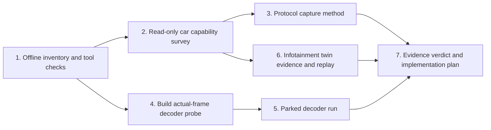

# Deep CarPlay diagnostics blueprint

**Date:** 2026-09-24  
**Objective:** determine what the 2018 Clarity actually advertises to the iPhone, whether Route Guidance or a second ScreenStream is negotiated, and whether its Android 4.2.2 AVC decoder can sustain two independent 800×480 streams. Capture enough display, app, and audio state to build an evidence-backed **infotainment** twin for offline workaround testing. Keep the factory center CarPlay and voice path intact. Do not touch CAN, warning, gauge, or vehicle-control interfaces.

## Known starting evidence

The verified original backup is at `~/ClarityLab/backups/CLARITY_BACKUP_20260918_0225_ORIGINAL` and stays untouched. Work only in `~/ClarityLab/clarity-analysis`. The September 18 read-only session captured ordinary logcat through a CarPlay reconnect but **not the raw iAP2 identification reply**. Static analysis of `jmcs` shows one Honda `gMainScreen` registration and `CopyDisplaysInfo` using the main screen; `libcarplay_proxy.so` has one global screen callback table. The September 25 parked diagnostic found usbmon absent and measured two simultaneous NVIDIA decoder instances outputting actual frames; see [session findings](../captures/20260925T150706Z-SESSION_FINDINGS.md). CarPlay decoder coexistence and packet-level capabilities remain unknown.

Apple's [WWDC19 vehicle-systems session](https://developer.apple.com/videos/play/wwdc2019/252/) distinguishes an additional H.264 cluster map stream from iAP2 Route Guidance metadata. The first requires multi-display receiver support; the second requires a car-drawn UI. Public talks do not provide the Honda's actual packet contents or its decoder limit.

## Dependency graph

### 1. Offline inventory and tool checks — Mac only

**Context:** the old logcat capture does not print identification packets; repeating it unchanged has low value. The backup contains Android `/system/xbin/busybox` but no `tcpdump`, `strace`, or `usbmon` executable. Kernel debug facilities are not known from the backup.

**Tasks:** use the completed receiver audit as the baseline; do not redo it. Prepare exact read-only checks for `/proc/config.gz`, an already-mounted `/sys/kernel/debug/usb/usbmon`, `/proc/<jmcs>/maps`, and open descriptors. Keep packet content local because it may contain identifiers. Prepare a parser that distinguishes observed bytes from inferred capability names, with an undecoded fallback.

**Exit:** a read-only command manifest, offline test of its output parser, and a decision on whether the next car step needs only ADB or also a separately reviewed tracing method. No car action yet.

**Current state:** the `capability-survey` and `process-inventory` commands ran on September 25. `CONFIG_USB_MON` is unset and the usbmon path is absent, so the prepared text summarizer cannot capture this car's traffic. `jmcs` maps/fds were permission denied to the ADB shell. No raw iAP2 bytes were obtained.

### 2. Read-only car capability survey — approximately 5 minutes parked

**Context:** car must be parked with wired CarPlay active and Wi-Fi ADB connected. The physical cluster safe area is still unknown. This step is the same single session as [the canonical car checklist](CAR_SESSION_CHECKLIST.md), not another session. `research/scripts/cluster_readonly_capture.py` now has `process-inventory`, `capability-survey`, and `twin-survey` phases.

**Tasks:** follow the canonical checklist once: photograph the physical cluster Navigation page with center Music and an Apple Maps route active; record spoken guidance. Run process inventory, capability survey, and two short `twin-survey` snapshots with casting off and on. Do not mount debugfs, load a module, run `su`, attach a tracer, install an APK, or reconnect the iPhone just for duplicate ordinary logs. Record permission denials verbatim.

**Exit:** physical-display geometry, the display/audio/service differences across casting states, and a yes/no/unknown for the presence and accessibility of an existing USB trace facility. The process inventory may identify endpoints but does **not** reveal packet payloads. If usbmon is absent/inaccessible, do not claim packet capture is possible from ADB alone.

### 3. Actual iAP2 identification observation — conditional parked session

**Context:** raw iAP2 identification is over the wired accessory path, and the saved Android log omits its bytes. Ordinary CarPlay IP packets alone are not a substitute. An existing usbmon endpoint, if readable, may provide USB bulk payloads; endpoint selection and iAP2 framing must be verified with captures, not guessed.

**Path A:** if step 2 finds a readable existing usbmon interface, prepare and bench-test a bounded capture that reads it to a Mac file while the iPhone reconnects once. Do not change mounts or car files. Establish the USB bus and endpoint carrying accessory traffic, start before reconnect, verify captured control/bulk continuity, reassemble iAP2 frames, and validate message IDs and integrity checks before decoding. Retain raw bytes and hashes. The [Linux usbmon text API](https://docs.kernel.org/usb/usbmon.html) may omit or truncate payload bytes even when a transfer length is shown; the prepared `usbmon_summary.py` reports those cases. State explicitly if truncation, encryption, fragmentation, packet loss, or wrong-endpoint capture prevents interpretation.

**Path B:** if no nonintrusive USB trace exists, investigate an external inline USB analyzer or an iPhone diagnostic log as separate methods. An iPhone log may reveal capability decisions but is not proof of raw packet bytes. Process injection, `ptrace`, replacing `jmcs`, or changing log-level config would alter the live receiver and require a separate exact rollback and recovery review before use.

**Exit:** answer two **separate** questions with distinct evidence: (a) does the iAP2 Identification exchange advertise a Route Guidance display component; (b) does the CarPlay capability/session exchange advertise and set up multiple display identities, view areas, and video streams? The latter may use a different protocol/channel and may remain opaque even if iAP2 is decoded. Each result must have an observed decoded payload or be marked unknown. Do not infer absence solely from a missing log line.

### 4. Build an actual-frame decoder probe — Mac only

**Context:** a source-only allocation probe would not establish sustained dual decoding or frame timing, so this stage built an API-17 app that feeds actual frames with no vehicle, network, audio, root, or cluster permissions.

**Tasks:** compile a signed diagnostic APK under `research/probes/decoder-capacity`; add a fixed-profile 800×480 H.264 test clip with recorded frame rate, bitrate, SPS/PPS, input-frame count, and SHA-256. Feed two decoders concurrently for a bounded duration and verify timed **output** frames from each decoder. Record codec name, output dimensions, frame counts, timing, errors, and cleanup. A software fallback is reported separately and does not pass the NVIDIA hardware gate. Test the app's decode state machine on an emulator or a Mac-side equivalent where possible; inspect final manifest, signing, SHA-256, and source/asset hashes. Make the uninstall command and expected `/data/app`/app-data changes explicit.

**Exit:** reproducible APK build, no unexpected permissions, bounded run, tested cleanup, and a reviewable exact install/run/uninstall card. The APK is **not installed** by completing this step.

**Current state:** the signed API-17 APK was approved, run, and removed September 25. A first Java linkage error was corrected in a rebuilt APK. One NVIDIA decoder produced 28/30 800×480 frames with EOS in 1954 ms; two simultaneous instances produced 28/30 each with EOS in 1973 ms. The strict 30-frame criterion remained incomplete. Cleanup and normal CarPlay/voice recovery were verified. The Activity covers the center screen while foregrounded, so a clean CarPlay-coexistence test still needs a separately built background-safe variant.

### 5. Decoder concurrency measurement — initial parked run complete

**Context:** installing the APK wrote `/data/app` temporarily. The exact run/rollback card was prepared, explicit user authorization was obtained, and the first bounded parked run was completed September 25. A future coexistence test would be a separately reviewed artifact and run.

**Tasks:** with CarPlay disconnected, run one and two simultaneous actual-frame decode tests; compare frame counts and timing. In a separate run, connect CarPlay and test one additional decode stream, observing whether center CarPlay and voice remain stable. Stop on any CarPlay glitch, warning, crash, or abnormal latency. Uninstall the exact diagnostic package afterward, verify package and app-data removal, and confirm the baseline CarPlay picture and spoken guidance after a normal session restart. Before this run, document how to stop the app and restart the head unit if a codec deadlocks or the app crashes.

**Exit:** concurrent actual-frame output was observed under the tested fixture, without all 30 expected frames. Allocation, sustained decoding, and coexistence with the **one existing** CarPlay decoder are separate results; none proves that two CarPlay streams can be negotiated. The package was removed and baseline restored. Investigate the two missing frames offline before tightening a future throughput gate.

### 6. Infotainment twin evidence and replay — Mac only

**Context:** the existing browser twin replays saved center/HDMI PNGs and hypothetical metadata/stream events. It does not emulate the receiver, audio stack, cluster electronics, or vehicle ECUs. [The bounded model and evidence gaps](../simulator/INFOTAINMENT_TWIN_SCOPE.md) define what can become faithful from this diagnostic session.

**Tasks:** compare the two casting-state snapshots with `research/scripts/twin_survey_compare.py`, then ingest photo-derived safe area, service and audio observations, and any later validated protocol events with timestamps and source labels. Keep synthetic vehicle values visibly synthetic. Replay app switches, route end, disconnect, casting changes, stale guidance, and decode failure. Compare captured frames and Android layer ownership against the model; retain opaque protocol events when bytes cannot be decoded.

**Exit:** a deterministic replay of observed infotainment behavior and a documented list of remaining hardware-only questions. Do not call it a full-car emulator or infer voice preservation from Mac output.

### 7. Evidence verdict and implementation plan — Mac only

**Tasks:** update `research/REPORT.md` with a table separating raw packet bytes, decoded fields, logs, static disassembly, displayed pixels, and inference. Decide whether native iAP2 route metadata is available, whether a second video stream can be negotiated by this receiver, and whether decoder capacity supports a candidate. Keep Apple Maps and Waze results separate. Then write the specific staged implementation plan, simulator acceptance tests, exact vehicle change and rollback for the best-supported branch. If any gate is unknown, state it and select the smallest next diagnostic rather than patching the receiver.

**Exit:** an evidence-backed branch decision: metadata-only bridge, multi-display receiver upgrade, or blocked/unknown under the tested conditions. Claim incompatibility only when a definitive mechanism is demonstrated. No firmware patch follows automatically from a successful diagnostic.

## Stop conditions and scope

- Never overwrite the verified original backup or safety-related display/gauge paths.
- No `adb remount`, `setprop`, firmware flash, receiver replacement, CAN injection, or on-car process patch in these stages.
- No raw protocol claims from ordinary logcat alone. A decoder `start()` success without output frames is allocation evidence only.
- Keep raw logs, packet payloads, and route/location data local under `research/captures/`.
