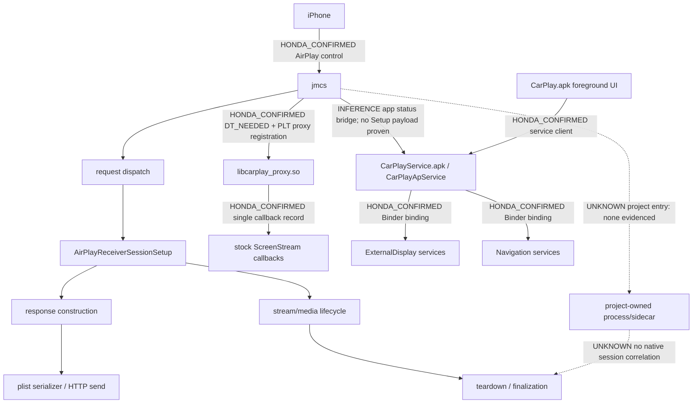

# 43T1-R3C expanded — process and entry map

Within `jmcs`, Dispatch→Setup→response→serializer is `HONDA_CONFIRMED` static control flow from [R3A](43t1-r3a-setup-path-seam-map.md). `jmcs`→proxy is a genuine dynamic boundary but leads to fixed stock media callbacks, not Setup. The app-service relationship is confirmed for status/display coordination in [service audit](43t1-r3c-honda-service-boundary-audit.md); any specific native Setup payload route across it is `UNKNOWN`, so the diagram does not claim one. Other linked libraries include Binder, Stagefright, media, GUI, crypto, and `libdl`; [dependency graph](jmcs-dependency-graph.md) gives the exact set.

Potential extension points assessed: proxy register (`REJECT_REPLACEMENT`), generic screen array (`REJECT_NO_SETUP_CONTEXT`), app-service callback (`REJECT_TOO_LATE`), direct Setup/serializer (`REJECT_RUNTIME_WRITE`), loader/preload (`REJECT_PERSISTENCE`), and hypothetical independent sidecar (`REJECT_NO_EVIDENCE`). [Matrix](43t1-r3c-extension-path-matrix.md) records all gate fields.
