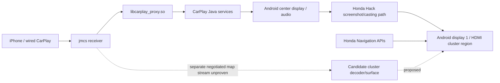

# Evidence-backed Clarity infotainment twin

**Scope:** offline models and captured display replay of the head unit, receiver seams, Android display-1 navigation area, Honda Hack casting, and audio/navigation state. The actual ARM receiver is not executed. Vehicle speed, gear, SOC, and range are **synthetic inputs** for display testing. This is not a full vehicle emulator or proof of native CarPlay support. The physical car remains the final compatibility test.

## Step 2 bounded checkpoint — September 28 UTC

Acceptance pending independent supervising Codex review; Step 2 remains partial.

| Layer | Implemented and checked | Still incomplete / unknown |
| --- | --- | --- |
| 1 Firmware/storage | Existing GPT fixture retained; [catalog](firmware-catalog.json) hashes 14 allowlisted receiver/config/APK/ODEX members in the complete working archives and eight runtime snapshot triples. Config hash matches the existing display profile. | Exhaustive app/service ownership, filesystem extraction and deeper reverse engineering are outside this bounded catalog. No raw vendor bytes in Git. |
| 2 Android/application | [Pure mocked Binder, Navigation, ExternalDisplay, display and Audio interfaces](service-model.js); three existing replay modes consume the same model. Factory TBT/bus methods are absent. | No Android services or real Binder transactions execute. Binding seams derive from [sanitized topology](../native/live-session-topology-20260925.md); route fields and live audio continuity are not established by a mock. |
| 3 Receiver ABI | Explicit JS model of six 32-bit callback offsets in 24 bytes and singleton duplicate-registration result `0x16` from [static audit](../native/receiver-multidisplay-audit.md). Mock USB/MFi readiness, display and audio. `replayRuntimeSnapshots` replays eight acquisition labels with observed file hashes, inferred app/connection state, synthetic callback actions/clock and unknown protocol/audio. | **Native ARM receiver execution and binary ABI harness remain unavailable.** No proprietary payload decoded, MFi authenticated, video decoded or second native callback supported. Proposed cluster stream is a separate synthetic contract, not an extension of the singleton ABI. |
| 4 Dual display | Six hash-verified consecutive center/HDMI pairs, head-unit Waze route/background/end, visibly synthetic map/metadata; browser replay in local Chromium. 800×480 center and HDMI surfaces; stale guidance/frame cleanup at modeled 15-second boundary; audio invariant checked separately as a model. | Photo-calibrated physical Navigation rectangle remains **unknown** (`rectangle: null`, `calibrated: false`). 584×215 layout is not a physical safe-area measurement. Replay timestamps are illustrative, not measured latency. Real audio/decoder coexistence and native negotiation remain pending their separate gates. |

`python3 research/simulator/check_offline.py --browser` is the review entry point (see README for environment). 15 Python tests, six legacy JS assertion suites, eight new model tests, and three browser mode checks pass locally. Browser tests inject a **modeled** disconnect after observed samples; they do not claim an unplug was captured. The model's TTL advances only on event/tick replay, not real wall time. No full Tegra/QEMU boot is required for this work.

## Current component model

The solid lines summarize inspected firmware and prior observations; they do not imply that CarPlay maneuver metadata flows into Honda Navigation. The dashed lines are the proposed native extension. Honda's factory navigation setters can emit B-CAN messages and are **excluded** as test interfaces.

## Evidence inventory and missing observations

| Boundary | Established evidence | Missing for a faithful twin |
| --- | --- | --- |
| iPhone to receiver | `jmcs` symbols, one configured main CarPlay screen, live iAP2/AirPlay threads and two IPv6 TCP flows | Raw iAP2 Identification fields; distinct CarPlay display identities and session setup. Built-in usbmon is absent on this kernel. |
| Video decoding | Approved API-17 probe produced 28/30 actual 800×480 frames from each of two simultaneous NVIDIA instances in 1973 ms | Explain two missing frames; sustained performance across profiles and coexistence with factory CarPlay |
| Center display | Saved 800×480 Maps/Music frames and SurfaceFlinger dump | Layer ownership and transitions with route active during a new controlled capture |
| Cluster output | Separate 800×480 Android HDMI display; Honda Hack 584×215 meter layout and 400×240 screenshot casting path; off/on SurfaceFlinger snapshots and physical Maps/Music photos | Calibrated safe boundary, side clearance near power/charge scales, and latency measurements |
| Route semantics | Honda native navigation types; CarPlay resource ownership strings; saved Apple Maps screenshot OCR | Decoded CarPlay route payloads, if present; maneuver/distance lifetimes; Waze-specific behavior |
| Audio | User verified spoken Apple Maps directions with casting on and after rollback; Android audio focus snapshot stayed on `AvApService` across casting states | Per-event audio trace and later voice validation with a proposed receiver/renderer change |
| Recovery | Simulator clears route/display on disconnect | On-car route end, unplug, receiver restart, and cast-off transitions, each observed without a write |

## Model contracts to build next

1. **Session timeline:** connection, receiver readiness, CarPlay primary display, route start/update/end, center app switch, cluster view ownership, casting enable/disable, and disconnect. Every event records observed vs synthetic provenance.
2. **Display compositor:** independently replay saved center and HDMI frames; place candidate map or guidance only inside the measured physical navigation safe area. Make clipping and occlusion visible. Never simulate speedometer/warning replacement.
3. **Audio observer:** record whether voice and music were heard and read-only Android route/focus state. Do not synthesize a claim that a candidate stream preserves voice; a later parked test must verify it.
4. **Receiver contract adapters:** accept parsed logcat, USB trace summaries, and (only if validated) decoded iAP2/CarPlay session events. Unknown or encrypted payloads remain opaque records, never fabricated fields.
5. **Deterministic replay:** events with monotonic timestamps, fixture hashes, source labels, and failure injection for dropped frames, stale guidance, disconnect, route end, center app switch, cast switch, and decoder failure.

The existing [`index.html`](index.html), [`digital-twin.js`](digital-twin.js), and JSONL samples now replay the measured September 25 casting transitions alongside hypothetical independent-stream/metadata behavior. They do not decode CarPlay traffic or emulate the Honda receiver. The [live topology](../native/live-session-topology-20260925.md) identifies additional event adapters the twin could model without pretending to reproduce proprietary transport bytes.

## Acceptance gates for the offline workaround

- Replaying an observed two-display timeline reproduces center and cluster frames with documented timing/provenance.
- Candidate map remains on the cluster when center switches Maps → Music, or a metadata card explicitly reports that its source is unavailable.
- Guidance and candidate frames clear on route end, CarPlay disconnect, stale update, or failed decoder, without covering the native non-navigation area.
- Apple Maps and Waze use separate fixtures and capability verdicts.
- Audio is treated as an invariant checked in later car validation, not inferred from the Mac replay.

After the parked survey and any conditional protocol/decoder measurements, choose the implementation branch from evidence: native metadata, independent map stream, or an interim display-only workaround. The final on-car change must have a reversible package/patch, exact affected components, recovery steps, and a separate review before use.
